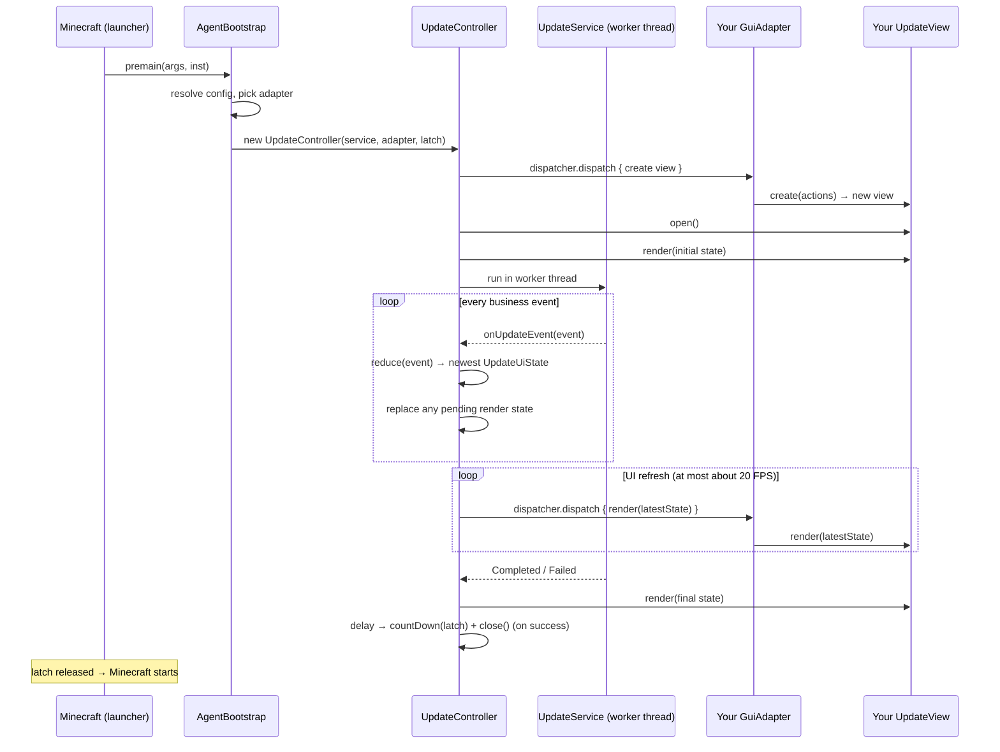

# GUI Adapter API

The updater exposes a stable, toolkit-neutral GUI boundary in
`com.zack88604.autoupdater.gui.api`. You can build your own GUI with Swing, JavaFX,
or any other toolkit **without touching the update logic, file synchronization, or
lifecycle control** (who releases the Minecraft launch latch and when the JVM exits).

This guide has seven parts:

1. [How the updater drives a GUI](#1-how-the-updater-drives-a-gui)
2. [Tutorial: build your own GUI](#2-tutorial-build-your-own-gui-in-5-steps)
3. [Registering your adapter](#3-registering-your-adapter)
4. [API reference](#4-api-reference)
5. [Rules & common pitfalls](#5-rules--common-pitfalls)
6. [Testing your adapter](#6-testing-your-adapter)
7. [V2 Java helper presets](#7-v2-java-helper-presets)

> A working reference implementation lives in `com.zack88604.autoupdater.gui.swing`
> (the built-in Swing adapter). Mirror its lifecycle rules, not its Swing-specific code.

Repository locations:

- Public contracts: `agent/src/com/zack88604/autoupdater/gui/api/`
- Built-in fallback: `agent/src/com/zack88604/autoupdater/gui/swing/`
- Preset discovery and V2 helper runtime: `agent/src/com/zack88604/autoupdater/gui/preset/`

---

## 1. How the updater drives a GUI

### 1.1 Runtime flow



### 1.2 Threading model

| Thread | What runs there |
|--------|-----------------|
| **Update worker** | `UpdateService.run(...)` — HTTP, hashing, downloads, cleanup. Emits `UpdateEvent`s. |
| **Controller** | Folds events into immutable state, keeps only the newest pending snapshot, and rate-limits renders to about 20 FPS. |
| **Your UI thread** | Everything `UpdateView` — reached through `GuiAdapter.dispatcher()`. |

- The update core **never** imports `javax.swing`, `javafx`, or AWT.
- Every `UpdateView` call (`open`, `render`, `close`) arrives on **your** UI thread
  through `UiDispatcher`.
- A render is not guaranteed for every event. Treat each state as a complete replacement;
  intermediate progress and log snapshots may be coalesced under load.
- Your adapter only ever receives immutable display state and forwards close intent
  back — keep it away from network, file, or process work.

### 1.3 Who owns what

| Concern | Owner |
|---------|-------|
| Update business flow (manifest, hashing, downloads, cleanup) | `UpdateService` |
| Event → snapshot reduction | `UpdateStateReducer` (called by the controller) |
| Rendering, user-facing copy, confirm dialogs | Your `UpdateView` |
| UI-thread marshalling | Your `GuiAdapter` / `UiDispatcher` |
| **Launch latch & `System.exit`** | `UpdateController` — nothing to do with your preset |

---

## 2. Tutorial: build your own GUI in 5 steps

The tutorial shows how to implement a custom GUI you can apply to any toolkit
(using Swing as the example).

### Step 1 — Dependencies and project layout

- Compile against `UpdateAgent_core.jar` as a **provided** dependency — do not
  bundle the updater API or core classes into your GUI jar.
- The GUI API lives in package `com.zack88604.autoupdater.gui.api`.

```text
my-gui/
  src/
    com/example/updategui/
      MyGuiAdapterFactory.java
      MyGuiAdapter.java
      MyGuiView.java
```

### Step 2 — Implement the factory

```java
package com.example.updategui;

import com.zack88604.autoupdater.gui.api.GuiAdapter;
import com.zack88604.autoupdater.gui.api.GuiAdapterContext;
import com.zack88604.autoupdater.gui.api.GuiAdapterFactory;

/** Must be public with a public no-arg constructor. */
public final class MyGuiAdapterFactory implements GuiAdapterFactory {

    @Override
    public GuiAdapter create(GuiAdapterContext context) {
        return new MyGuiAdapter(context.getGameDirectory(), context.isDebug());
    }
}
```

### Step 3 — Implement the adapter + dispatcher

The adapter supplies the UI-thread bridge and creates your view.

```java
package com.example.updategui;

import com.zack88604.autoupdater.gui.api.*;
import javax.swing.SwingUtilities;

public final class MyGuiAdapter implements GuiAdapter {

    private final String gameDirectory;
    private final boolean debug;

    public MyGuiAdapter(String gameDirectory, boolean debug) {
        this.gameDirectory = gameDirectory;
        this.debug = debug;
    }

    @Override
    public UiDispatcher dispatcher() {
        // Example for Swing; for JavaFX use Platform::runLater.
        return SwingUtilities::invokeLater;
    }

    @Override
    public UpdateView create(UpdateViewActions actions) {
        return new MyGuiView(actions, gameDirectory, debug);
    }
}
```

### Step 4 — Implement the view

```java
package com.example.updategui;

import javax.swing.*;
import com.zack88604.autoupdater.gui.api.*;

public final class MyGuiView implements UpdateView {

    private final UpdateViewActions actions;
    private final JFrame frame = new JFrame("Minecraft Updater");
    private final JLabel status = new JLabel();
    private final JProgressBar progress = new JProgressBar();
    private UpdateUiState currentState = UpdateUiState.initial();

    public MyGuiView(UpdateViewActions actions, String gameDir, boolean debug) {
        this.actions = actions;
        // ... assemble the window ...
        progress.setStringPainted(true);
        frame.setDefaultCloseOperation(WindowConstants.DO_NOTHING_ON_CLOSE);

        // Report user intent back to the controller:
        frame.addWindowListener(new java.awt.event.WindowAdapter() {
            @Override public void windowClosing(java.awt.event.WindowEvent e) {
                requestWindowClose();
            }
            @Override public void windowClosed(java.awt.event.WindowEvent e) {
                actions.notifyWindowClosed();      // native window really closed
            }
        });
    }

    private void requestWindowClose() {
        if (currentState.getClosePolicy() == ClosePolicy.CONFIRM) {
            actions.beginCloseConfirmation();
            int choice = JOptionPane.showConfirmDialog(frame,
                    "Stop this update, restore changed files, and launch Minecraft?",
                    "Update in progress", JOptionPane.YES_NO_OPTION,
                    JOptionPane.WARNING_MESSAGE);
            if (choice != JOptionPane.YES_OPTION) {
                actions.cancelCloseConfirmation();
                return;
            }
        }
        actions.requestClose();
    }

    @Override
    public void open() {
        frame.setVisible(true);
    }

    @Override
    public void render(UpdateUiState state) {
        currentState = state;
        // `state` is a complete snapshot — render it whole.
        status.setText(state.getStatus());
        if (state.isOverallProgressIndeterminate()) {
            progress.setIndeterminate(true);
        } else {
            progress.setIndeterminate(false);
            progress.setValue(state.getOverallProgressPercent());
        }
        // Also available: state.getPhase(), state.getLogLines(),
        // state.getDownloadProgress(), state.getSummary(), ...
    }

    @Override
    public void close() {
        frame.dispose();
    }
}
```

Key points:

- `render(state)` hands you the **entire** newest state. Some intermediate states
  can be skipped under load, so do not infer business conditions from a sequence of
  rendered strings.
- Keep only the latest immutable state needed for display or close-policy handling;
  never mutate it or use the view as updater business state.
- `open` / `render` / `close` all run on your UI thread as long as you return a
  working `UiDispatcher`.

### Step 5 — Handle close correctly

Your view never decides outcomes; it only reports **intent** through
`UpdateViewActions`:

| Method | When to call |
|--------|--------------|
| `beginCloseConfirmation()` | Immediately before opening a `CONFIRM` dialog. The worker pauses at its next safe checkpoint. |
| `cancelCloseConfirmation()` | When the user rejects or dismisses that dialog. The worker resumes. |
| `requestClose()` | After the user confirmed closing, or immediately when the policy is `ALLOW`. |
| `notifyWindowClosed()` | The native window has actually finished closing. |

The controller applies the current **close policy** from the state:

| `ClosePolicy` | When | What a close does |
|---------------|------|-------------------|
| `CONFIRM` | Update in progress | Set the native close operation to "do nothing", call `beginCloseConfirmation()` immediately before showing a toolkit-specific warning, and call `cancelCloseConfirmation()` if it is rejected. If confirmed, call `requestClose()`: the updater cancels, restores every file changed in this update, then starts Minecraft and closes the view. |
| `ALLOW` | Update succeeded | Closing is allowed; the latch is released and the window closes. |
| `EXIT_FAILURE` | Update failed | Any close (requested or native) calls `System.exit(1)` — **Minecraft will not start**. |

> Never release the latch or call `System.exit` yourself. The controller owns both.

`beginCloseConfirmation()` and `cancelCloseConfirmation()` are default methods, so
existing adapters remain source- and binary-compatible. To pause work while their
confirmation dialog is visible, adapters must adopt the sequence above.

---

## 3. Registering your adapter

### 3.1 Method A — compile into the core, select by property

Compile your factory and adapter **into `UpdateAgent_core.jar`** together with the
agent sources, then configure the fully-qualified factory class name. It can be
supplied through any config source (first source wins in normal mode; `admin=true`
reverses the order):

| Source | Example |
|--------|---------|
| `mc-update.properties` in the game dir | `gui-adapter=com.example.updategui.MyGuiAdapterFactory` |
| Inline agent argument | `-javaagent:UpdateAgent.jar=gui-adapter=com.example.updategui.MyGuiAdapterFactory` |
| System property | `-D mc-update.gui-adapter=com.example.updategui.MyGuiAdapterFactory` |

When no factory is configured, the built-in Swing adapter is used.

### 3.2 Method B — external GUI preset (no agent rebuild)

If `gui-adapter` is **not** configured, the updater scans a fixed location under the
Minecraft directory:

```text
<game-dir>/
  .mc-update/                       # updater-owned
    gui-selection.properties        # saved default (managed by the updater)
    gui-presets/
      my-gui.jar                    # your packaged preset
```

`mc-update.properties` stays in the game root — it does not decide the preset selection.

#### Preset archive format

A selectable preset JAR must contain this metadata file:

```properties
# META-INF/mc-update-gui.properties
name=Example GUI
version=1.0.0
factory-class=com.example.updategui.MyGuiAdapterFactory
```

- `factory-class` is required; `name` / `version` are shown in the chooser.
- The factory class must be `public`, have a `public` no-arg constructor, and
  implement `GuiAdapterFactory`.
- Build against `UpdateAgent_core.jar` as a **provided** dependency; do not bundle
  the updater API or core classes inside the preset.

Example packaging (from your build output directory):

```bash
jar cf my-gui.jar -C classes . -C meta META-INF
# where meta/META-INF/mc-update-gui.properties contains the metadata above
```

#### Selection & fallback behavior

1. **First launch** (no saved choice): a trusted built-in Swing dialog lets the user
   pick an external preset or the built-in Swing GUI. A checkbox ("remember") saves
   the choice to `gui-selection.properties`.
2. **Saved Swing choice** → starts directly.
3. **Saved external preset** → every launch shows a **risk confirmation** before the
   preset JAR is loaded.
4. **Fallback**: if the user declines, the JAR fails to load, or the preset metadata
   disappears → the updater falls back to built-in Swing (a failed load also clears
   the saved selection).
5. Delete `gui-selection.properties` → the chooser appears again.

#### Security

- Classes are loaded **only after** the user confirms the warning.
- An external preset executes code **inside the game process**: it may read or modify
  files, access the network, or affect the game. Install only JARs from a trusted source.

---

## 4. API reference

All types live in `com.zack88604.autoupdater.gui.api`.

### 4.1 `GuiAdapterFactory` (interface)

```java
GuiAdapter create(GuiAdapterContext context);
```

Creates one adapter per launch. Must be `public` with a `public` no-arg constructor
when selected by class name or from a preset.

### 4.2 `GuiAdapter` (interface)

```java
UiDispatcher dispatcher();
UpdateView   create(UpdateViewActions actions);
```

- `dispatcher()` — the bridge to your UI thread (e.g. `SwingUtilities::invokeLater`).
- `create(actions)` — build a new, **not-yet-opened** `UpdateView` bound to the
  controller's action callbacks. Called on your UI thread.

### 4.3 `UiDispatcher` (interface, `@FunctionalInterface`)

```java
void dispatch(Runnable task);
```

Schedules a task on your toolkit's UI thread.

### 4.4 `UpdateView` (interface)

```java
void open();                   // show the window (once, before the first render)
void render(UpdateUiState s);  // render a complete replacement snapshot
void close();                  // the controller decided to close the window
```

All three are invoked on your UI thread through your dispatcher.

### 4.5 `UpdateViewActions` (interface)

```java
void beginCloseConfirmation();  // pause before showing a CONFIRM dialog
void cancelCloseConfirmation(); // resume after the dialog is rejected
void requestClose();            // the user confirmed closing
void notifyWindowClosed();      // the native window finished closing
```

Implemented by the controller — see [Step 5](#step-5--handle-close-correctly).

### 4.6 `ClosePolicy` (enum)

`CONFIRM` · `ALLOW` · `EXIT_FAILURE` — see the table in [Step 5](#step-5--handle-close-correctly).

### 4.7 `GuiAdapterContext` (immutable)

| Method | Meaning |
|--------|---------|
| `String getGameDirectory()` | Configured Minecraft root — for presentation resources. |
| `String getUpdaterConfigurationDirectory()` | Updater-owned config dir (`<gameDir>/.mc-update`). |
| `boolean isDebug()` | Keep a successful view open for inspection (`mc-update.debug`). |

Presentation settings only — no services, no mutable config, no process control.

### 4.8 `UpdateUiState` (immutable, complete snapshot)

| Field | Method | Meaning |
|-------|--------|---------|
| `UpdatePhase` | `getPhase()` | Current stage (see 4.9). |
| `String` | `getStatus()` | Headline text, e.g. "Downloading: mods/x.jar". |
| `String` | `getDescription()` | Secondary text (may be empty). |
| `List<String>` | `getLogLines()` | Chronological display-log tail. It is capped at 250 lines; a marker replaces omitted earlier entries. |
| `List<String>` | `getServerUrls()` | Configured servers in priority order. |
| `String` | `getCurrentServer()` | Active server (`null` before selection). |
| `int` | `getOverallProgressPercent()` | Overall progress 0–100. |
| `boolean` | `isOverallProgressIndeterminate()` | Show an indeterminate bar. |
| `DownloadProgress` | `getDownloadProgress()` | Current download (or inactive). |
| `ClosePolicy` | `getClosePolicy()` | How a close request is treated. |
| `UpdateSummary` | `getSummary()` | Terminal result; `null` while running. |
| `String` | `getErrorMessage()` | Display-safe failure text; `null` when none. |

Build helpers: `UpdateUiState.initial()`, `UpdateUiState.builder()`. Render **the
whole object** in `render(...)`; treat it as immutable. A view may keep the latest
snapshot for display and close handling, but must not mutate it or reconstruct updater state.

### 4.9 `UpdatePhase` (enum)

| Phase | Meaning |
|-------|---------|
| `PREPARING` | Fetching the manifest, checking agent self-update. |
| `CHECKING` | Hashing local files against the manifest. |
| `DOWNLOADING` | Downloading a managed resource file. |
| `CLEANING` | Removing stale managed files. |
| `SUCCESS` | Completed with no failed files. |
| `ERROR` | Failed, or completed with failed files. |

### 4.10 `DownloadProgress` (immutable)

```java
DownloadProgress.inactive();
DownloadProgress.active(String path, Kind kind, long downloadedBytes,
                        long totalBytes, double bytesPerSecond);
```

| Method | Meaning |
|--------|---------|
| `isActive()` | Is a download running right now? |
| `getPath()` / `getKind()` | What is being downloaded. |
| `getDownloadedBytes()` / `getTotalBytes()` | Progress (`totalBytes` may be `0` = unknown). |
| `getBytesPerSecond()` | Current transfer rate. |

`Kind`: `FILE` (managed resource), `UPDATER` (new `UpdateAgent_core.jar`),
`GUI_RUNTIME` (reserved for GUI runtime artifacts).

### 4.11 `UpdateSummary` (immutable)

| Method | Meaning |
|--------|---------|
| `getUpdatedFiles()` / `getFailedFiles()` | Terminal file counts. |
| `isSuccessful()` | `failedFiles == 0`. |

---

## 5. Rules & common pitfalls

- **Do** implement exactly `GuiAdapter`, `UiDispatcher`, `UpdateView`; use
  `GuiAdapterContext` only for presentation settings.
- **Do** make every `UpdateView` call run on the UI thread via your `UiDispatcher`.
- **Do** treat `render(state)` input as a complete replacement snapshot.
- **Do** make rendering inexpensive; the controller may skip intermediate states to
  keep the UI responsive during large cleanups.
- **Don't** infer business state from previously rendered strings.
- **Don't** keep mutable updater state in the view.
- **Don't** call `UpdateViewActions` for anything except close intent / native close.
- **Don't** release the launch latch, call `System.exit`, or access updater
  HTTP / file / process code from the adapter.

## 6. Testing your adapter

1. Start a server and generate a manifest (see the README Quick Start).
2. Point a game directory at it and select your adapter.
3. Set `mc-update.debug=true` to keep the window open on success for inspection.
4. Touch a managed file to exercise `DOWNLOADING`; remove many manifest entries to
   exercise `CLEANING`; while cleanup is busy, request close and verify that the
   confirmation remains responsive. Confirming it must cancel at a safe checkpoint,
   restore files changed by that update, launch Minecraft, and close the view.
5. Stop the server mid-flight to exercise failover and failure paths (confirm
   `EXIT_FAILURE` exits the JVM on close).

---

## 7. V2 Java helper presets

Use a V2 preset when the GUI needs a runtime that must not enter the Minecraft
JVM, such as JavaFX or Compose Desktop. The updater verifies and extracts the
runtime artifacts only after the user accepts the external-code warning, then
starts a child Java process. The child receives complete, latest-state
`UpdateUiState` snapshots and can return only the standard close actions.

V1 presets remain unchanged: omit `preset-api` or set it to `1` and implement
`GuiAdapterFactory` as described above.

### 7.1 Archive metadata

```properties
# META-INF/mc-update-gui.properties
preset-api=2
name=Example Java Helper
version=1.0.0
factory-class=com.example.updategui.HelperPresetFactory
runtime-kind=java-helper
runtime-manifest=META-INF/mc-update-runtime.properties
```

The factory must implement `JavaHelperGuiPresetFactory`, have a public no-arg
constructor, and keep JavaFX/other runtime classes out of its signature and
static initialization.

### 7.2 Runtime manifest

```properties
# META-INF/mc-update-runtime.properties
helper-main-class=com.example.updategui.FxHelperMain
minimum-java-version=11

# Archive resources to extract to .mc-update/gui-runtimes/<preset-hash>/
module-path=runtime/javafx-base.jar,runtime/javafx-graphics.jar,runtime/javafx-controls.jar
add-modules=javafx.controls
sha256.runtime/javafx-base.jar=<64 lowercase-or-uppercase hex characters>
sha256.runtime/javafx-graphics.jar=<64 lowercase-or-uppercase hex characters>
sha256.runtime/javafx-controls.jar=<64 lowercase-or-uppercase hex characters>
```

`classpath` is available for ordinary dependency JARs. Every resource named by
`classpath` or `module-path` requires a matching `sha256.<resource>` value.
Runtime resources must be packaged inside the preset archive; the updater never
downloads runtime code on a preset's behalf.

### 7.3 Bootstrap and helper entry point

```java
public final class HelperPresetFactory implements JavaHelperGuiPresetFactory {
    @Override
    public JavaHelperLaunchSpec create(GuiAdapterContext context) {
        return JavaHelperLaunchSpec.empty();
    }
}

public final class FxHelperMain implements JavaHelperEntrypoint {
    @Override
    public void run(JavaHelperSession session) throws Exception {
        // Start your toolkit, then signal that it can accept rendering.
        session.signalReady();
        JavaHelperCommand command;
        while ((command = session.nextCommand()) != null) {
            switch (command.getType()) {
                case OPEN:   /* show window */ break;
                case RENDER: /* render command.getState() */ break;
                case CLOSE:  /* close window and return */ return;
                default: break;
            }
        }
    }
}
```

When the helper shows a `ClosePolicy.CONFIRM` dialog, call
`session.beginCloseConfirmation()` before displaying it; call
`session.cancelCloseConfirmation()` on rejection, or `session.requestClose()`
on confirmation. Call `session.notifyWindowClosed()` after native close. Never
write diagnostic text to `System.out` in the child process: it is reserved for
the helper protocol; use `System.err` instead.

If verification, extraction, Java-version validation, factory loading, or
helper startup fails, the updater clears the remembered selection and falls
back to the built-in Swing GUI.
