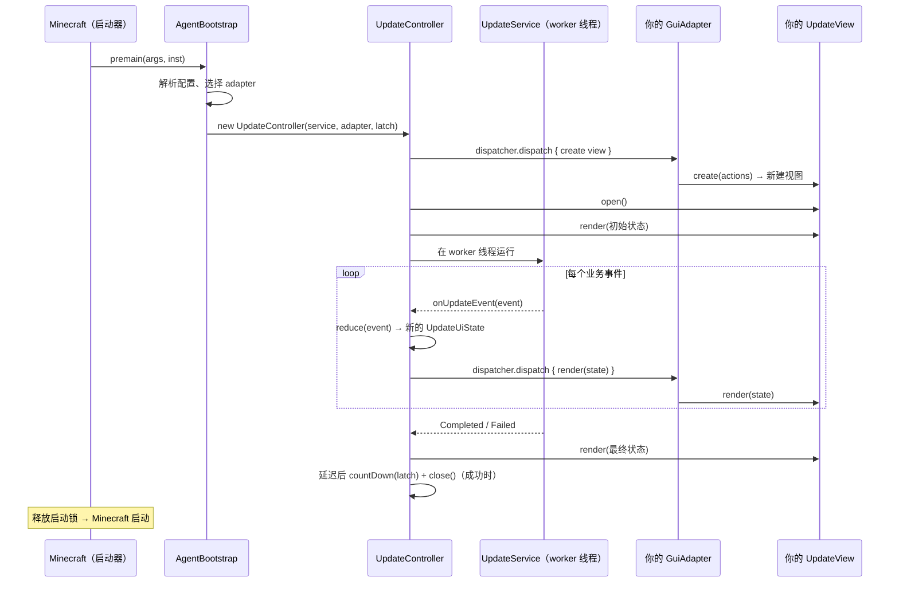

# GUI Adapter API（中文）

更新器在 `com.zack88604.autoupdater.gui.api` 中提供稳定、与 GUI 工具包无关的
接口边界。你可以用 Swing、JavaFX 或任意其他工具包实现自己的 GUI，**完全不需要改动
更新逻辑、文件同步或生命周期控制**（由谁释放 Minecraft 启动锁、何时退出 JVM）。

本文档包含四个部分：

1. [更新器如何驱动 GUI](#1-更新器如何驱动-gui)
2. [教程：打造自己的 GUI](#2-教程5-步打造自己的-gui)
3. [注册你的 adapter](#3-注册你的-adapter)
4. [API 参考](#4-api-参考)

> 可运行的参考实现位于 `com.zack88604.autoupdater.gui.swing`（内建 Swing adapter），
> 为自己的工具包实现时照它来写即可。

---

## 1. 更新器如何驱动 GUI

### 1.1 运行时流程



### 1.2 线程模型

| 线程 | 在上面运行什么 |
|------|----------------|
| **Update worker** | `UpdateService.run(...)`——HTTP、哈希、下载、清理，发出 `UpdateEvent`。 |
| **Controller** | 把每个事件规约为不可变 `UpdateUiState`，再调度一次渲染。 |
| **你的 UI 线程** | 全部 `UpdateView` 方法——通过 `GuiAdapter.dispatcher()` 到达。 |

- 更新核心**从不** import `javax.swing`、`javafx` 或 AWT。
- 所有 `UpdateView` 调用（`open`、`render`、`close`）都经 `UiDispatcher` 在你的 UI
  线程上执行。
- 你的 adapter 只接收不可变的展示状态，并把关闭意图传回去，不要涉及网络、文件或
  进程操作。

### 1.3 职责划分

| 关注点 | 归属 |
|--------|------|
| 更新业务流程（清单、哈希、下载、清理） | `UpdateService` |
| 事件 → 快照归约 | `UpdateStateReducer`（由 controller 调用） |
| 渲染、文案、确认对话框 | 你的 `UpdateView` |
| UI 线程调度 | 你的 `GuiAdapter` / `UiDispatcher` |
| **启动锁与 `System.exit`** | `UpdateController`——与你的预设无关 |

---

## 2. 教程：5 步打造自己的 GUI

下面演示如何实现自定义 GUI，可以套用到任意工具包（以 Swing 为例）。

### 第 1 步 — 依赖与工程结构

- 以 `UpdateAgent_core.jar` 作为 **provided** 依赖编译——**不要**把更新器 API 或
  core 类打包进你的 GUI jar。
- GUI API 位于包 `com.zack88604.autoupdater.gui.api`。

```text
my-gui/
  src/
    com/example/updategui/
      MyGuiAdapterFactory.java
      MyGuiAdapter.java
      MyGuiView.java
```

### 第 2 步 — 实现工厂

```java
package com.example.updategui;

import com.zack88604.autoupdater.gui.api.GuiAdapter;
import com.zack88604.autoupdater.gui.api.GuiAdapterContext;
import com.zack88604.autoupdater.gui.api.GuiAdapterFactory;

/** 必须为 public，且具有 public 无参构造函数。 */
public final class MyGuiAdapterFactory implements GuiAdapterFactory {

    @Override
    public GuiAdapter create(GuiAdapterContext context) {
        return new MyGuiAdapter(context.getGameDirectory(), context.isDebug());
    }
}
```

### 第 3 步 — 实现 adapter 与 dispatcher

adapter 提供 UI 线程桥接，并创建你的视图。

```java
package com.example.updategui;

import com.zack88604.autoupdater.gui.api.*;

public final class MyGuiAdapter implements GuiAdapter {

    private final String gameDirectory;
    private final boolean debug;

    public MyGuiAdapter(String gameDirectory, boolean debug) {
        this.gameDirectory = gameDirectory;
        this.debug = debug;
    }

    @Override
    public UiDispatcher dispatcher() {
        // Swing 示例；JavaFX 可用 Platform::runLater。
        return SwingUtilities::invokeLater;
    }

    @Override
    public UpdateView create(UpdateViewActions actions) {
        return new MyGuiView(actions, gameDirectory, debug);
    }
}
```

### 第 4 步 — 实现视图

```java
package com.example.updategui;

import javax.swing.*;
import com.zack88604.autoupdater.gui.api.*;

public final class MyGuiView implements UpdateView {

    private final UpdateViewActions actions;
    private final JFrame frame = new JFrame("Minecraft Updater");
    private final JLabel status = new JLabel();
    private final JProgressBar progress = new JProgressBar();
    private UpdateUiState currentState = UpdateUiState.initial();

    public MyGuiView(UpdateViewActions actions, String gameDir, boolean debug) {
        this.actions = actions;
        // ... 组装窗口 ...
        progress.setStringPainted(true);
        frame.setDefaultCloseOperation(WindowConstants.DO_NOTHING_ON_CLOSE);

        // 把用户意图上报给 controller：
        frame.addWindowListener(new java.awt.event.WindowAdapter() {
            @Override public void windowClosing(java.awt.event.WindowEvent e) {
                requestWindowClose();
            }
            @Override public void windowClosed(java.awt.event.WindowEvent e) {
                actions.notifyWindowClosed();      // 原生窗口已关闭
            }
        });
    }

    private void requestWindowClose() {
        if (currentState.getClosePolicy() == ClosePolicy.CONFIRM) {
            actions.beginCloseConfirmation();
            int choice = JOptionPane.showConfirmDialog(frame,
                    "停止本次更新、还原已修改文件并启动 Minecraft？",
                    "更新进行中", JOptionPane.YES_NO_OPTION,
                    JOptionPane.WARNING_MESSAGE);
            if (choice != JOptionPane.YES_OPTION) {
                actions.cancelCloseConfirmation();
                return;
            }
        }
        actions.requestClose();
    }

    @Override
    public void open() {
        frame.setVisible(true);
    }

    @Override
    public void render(UpdateUiState state) {
        currentState = state;
        // `state` 是完整快照，需要整体替换渲染。
        status.setText(state.getStatus());
        if (state.isOverallProgressIndeterminate()) {
            progress.setIndeterminate(true);
        } else {
            progress.setIndeterminate(false);
            progress.setValue(state.getOverallProgressPercent());
        }
        // 还可以用 state.getPhase()、state.getLogLines()、
        // state.getDownloadProgress()、state.getSummary() ...
    }

    @Override
    public void close() {
        frame.dispose();
    }
}
```

要点：

- `render(state)` 给你的**始终是完整的新状态**——请勿根据旧文案推断业务状态，
  或在视图里保留可变的更新器状态。
- 只要返回可用的 `UiDispatcher`，`open` / `render` / `close` 都会在你的 UI 线程
  上执行。

### 第 5 步 — 正确处理关闭

你的视图只上报**意图**，不决定结果，统一通过 `UpdateViewActions`：

| 方法 | 何时调用 |
|------|----------|
| `beginCloseConfirmation()` | 即将显示 `CONFIRM` 确认框前立即调用；工作线程会在下一个安全检查点暂停。 |
| `cancelCloseConfirmation()` | 用户拒绝或关闭确认框时调用；工作线程恢复。 |
| `requestClose()` | 用户确认关闭后调用；`ALLOW` 策略时可直接调用。 |
| `notifyWindowClosed()` | 原生窗口真正关闭完成。 |

controller 根据当前状态中的**关闭策略**决定结果：

| `ClosePolicy` | 何时 | 关闭会发生什么 |
|---------------|------|----------------|
| `CONFIRM` | 更新进行中 | 将原生关闭操作设为「不执行任何操作」，并在显示工具包确认警告前立刻调用 `beginCloseConfirmation()`；若用户拒绝则调用 `cancelCloseConfirmation()`。若确认则调用 `requestClose()`：更新器取消任务、还原本次更新改动过的全部文件，再启动 Minecraft 并关闭视图。 |
| `ALLOW` | 更新成功 | 允许关闭；启动锁被释放，窗口关闭。 |
| `EXIT_FAILURE` | 更新失败 | 任何关闭（请求或原生）都会调用 `System.exit(1)`——**Minecraft 不会启动**。 |

> 切勿自行释放启动锁或调用 `System.exit`，两者都由 controller 掌控。

`beginCloseConfirmation()` 和 `cancelCloseConfirmation()` 是默认方法，因此已有
adapter 在源码和二进制层面均可继续兼容。要让确认框显示期间暂停后台工作，adapter
需要按上述顺序接入这两个方法。

---

## 3. 注册你的 adapter

### 3.1 方式 A — 编译进核心，用属性选择

把工厂和 adapter **与 agent 源码一起编译进 `UpdateAgent_core.jar`**，然后配置完整
类名。可通过任意配置源提供（普通模式按优先级取第一个命中的；`admin=true` 反转顺序）：

| 来源 | 示例 |
|------|------|
| 游戏目录 `mc-update.properties` | `gui-adapter=com.example.updategui.MyGuiAdapterFactory` |
| 内联 agent 参数 | `-javaagent:UpdateAgent.jar=gui-adapter=com.example.updategui.MyGuiAdapterFactory` |
| 系统属性 | `-D mc-update.gui-adapter=com.example.updategui.MyGuiAdapterFactory` |

未配置任何工厂时，使用内建 Swing adapter。

### 3.2 方式 B — 外部 GUI 预设（无需重新构建 agent）

未配置 `gui-adapter` 时，更新器会扫描游戏根目录下的固定位置：

```text
<game-dir>/
  .mc-update/                       # 更新器自有目录
    gui-selection.properties        # 保存的默认选择（由更新器管理）
    gui-presets/
      my-gui.jar                    # 你的预设包
```

`mc-update.properties` 保留在游戏根目录，不决定预设选择。

#### 预设 JAR 格式

可选择的预设 JAR 必须包含以下元数据：

```properties
# META-INF/mc-update-gui.properties
name=Example GUI
version=1.0.0
factory-class=com.example.updategui.MyGuiAdapterFactory
```

- `factory-class` 必填；`name` / `version` 用于选择窗口展示。
- 工厂类必须为 `public`、具有 `public` 无参构造函数，并实现 `GuiAdapterFactory`。
- 以 `UpdateAgent_core.jar` 作为 **provided** 依赖编译，不要把更新器 API 或 core 类
  再次打包进预设。

示例打包命令（在你的编译输出目录执行）：

```bash
jar cf my-gui.jar -C classes . -C meta META-INF
# 其中 meta/META-INF/mc-update-gui.properties 存放上面的元数据
```

#### 选择与回退行为

1. **首次启动**（未保存选择）：由受信任的内建 Swing 对话框让用户选择外部预设或内建
   Swing GUI；复选框（「记住选择」）把结果保存到 `gui-selection.properties`。
2. **已保存 Swing 选择** → 直接启动。
3. **已保存外部预设** → 每次加载 JAR 前显示**风险确认**。
4. **回退**：用户拒绝确认、加载失败或元数据消失 → 回退到内建 Swing（加载失败还会
   清除已保存的选择）。
5. 删除 `gui-selection.properties` → 重新显示选择窗口。

#### 安全说明

- 只有用户确认风险后才会加载类。
- 外部预设**在游戏进程中执行代码**：可能读写文件、访问网络或影响游戏。只能安装
  来自可信来源的 JAR。

---

## 4. API 参考

所有类型都在 `com.zack88604.autoupdater.gui.api` 中。

### 4.1 `GuiAdapterFactory`（接口）

```java
GuiAdapter create(GuiAdapterContext context);
```

每次启动创建一个 adapter。若通过类名或预设选择，则必须为 `public` 且具有 `public`
无参构造函数。

### 4.2 `GuiAdapter`（接口）

```java
UiDispatcher dispatcher();
UpdateView   create(UpdateViewActions actions);
```

- `dispatcher()` —— 到你 UI 线程的桥接（例如 `SwingUtilities::invokeLater`）。
- `create(actions)` —— 构建一个**尚未打开**的 `UpdateView`，绑定 controller 的回调。
  在你的 UI 线程上调用。

### 4.3 `UiDispatcher`（接口，`@FunctionalInterface`）

```java
void dispatch(Runnable task);
```

把任务调度到工具包的 UI 线程上执行。

### 4.4 `UpdateView`（接口）

```java
void open();                   // 显示窗口（只调一次，在首次渲染前）
void render(UpdateUiState s);  // 渲染完整替换快照
void close();                  // controller 决定关闭窗口
```

三个方法都由 controller 通过你的 dispatcher 在你的 UI 线程上调用。

### 4.5 `UpdateViewActions`（接口）

```java
void beginCloseConfirmation();  // 显示 CONFIRM 确认框前暂停
void cancelCloseConfirmation(); // 确认被拒绝后恢复
void requestClose();            // 用户已确认关闭
void notifyWindowClosed();      // 原生窗口关闭完成
```

由 controller 实现——见[第 5 步](#第-5-步--正确处理关闭)。

### 4.6 `ClosePolicy`（枚举）

`CONFIRM` · `ALLOW` · `EXIT_FAILURE` —— 见[第 5 步](#第-5-步--正确处理关闭)的表格。

### 4.7 `GuiAdapterContext`（不可变）

| 方法 | 含义 |
|------|------|
| `String getGameDirectory()` | 配置的 Minecraft 根目录——用于展示资源。 |
| `String getUpdaterConfigurationDirectory()` | 更新器自有配置目录（`<gameDir>/.mc-update`）。 |
| `boolean isDebug()` | 是否在成功后保持窗口打开以便检查（`mc-update.debug`）。 |

仅含展示相关设置——没有服务、可变配置或进程控制。

### 4.8 `UpdateUiState`（不可变、完整快照）

| 字段 | 方法 | 含义 |
|------|------|------|
| `UpdatePhase` | `getPhase()` | 当前阶段（见 4.9）。 |
| `String` | `getStatus()` | 主文案，如 "Downloading: mods/x.jar"。 |
| `String` | `getDescription()` | 次要文案（可为空）。 |
| `List<String>` | `getLogLines()` | 按时间顺序的日志快照。 |
| `List<String>` | `getServerUrls()` | 按优先级排列的服务器列表。 |
| `String` | `getCurrentServer()` | 当前服务器（选择前为 `null`）。 |
| `int` | `getOverallProgressPercent()` | 总体进度 0–100。 |
| `boolean` | `isOverallProgressIndeterminate()` | 是否显示不确定进度条。 |
| `DownloadProgress` | `getDownloadProgress()` | 当前下载（无下载时为 inactive）。 |
| `ClosePolicy` | `getClosePolicy()` | 关闭请求的处理策略。 |
| `UpdateSummary` | `getSummary()` | 最终结果；运行中为 `null`。 |
| `String` | `getErrorMessage()` | 可安全展示的错误信息；无错误时为 `null`。 |

构造辅助：`UpdateUiState.initial()`、`UpdateUiState.builder()`。在 `render(...)` 中
**整体渲染整个对象**；把它视为不可变，调用返回后不要保留。

### 4.9 `UpdatePhase`（枚举）

| 阶段 | 含义 |
|------|------|
| `PREPARING` | 拉取清单、检查 agent 自更新。 |
| `CHECKING` | 对照清单哈希本地文件。 |
| `DOWNLOADING` | 下载受管资源文件。 |
| `CLEANING` | 清理过期受管文件。 |
| `SUCCESS` | 无失败文件地完成。 |
| `ERROR` | 失败，或完成但存在失败文件。 |

### 4.10 `DownloadProgress`（不可变）

```java
DownloadProgress.inactive();
DownloadProgress.active(String path, Kind kind, long downloadedBytes,
                        long totalBytes, double bytesPerSecond);
```

| 方法 | 含义 |
|------|------|
| `isActive()` | 当前是否有下载在进行。 |
| `getPath()` / `getKind()` | 正在下载什么。 |
| `getDownloadedBytes()` / `getTotalBytes()` | 进度（`totalBytes` 为 `0` 表示未知）。 |
| `getBytesPerSecond()` | 当前传输速率。 |

`Kind`：`FILE`（受管资源）、`UPDATER`（新版 `UpdateAgent_core.jar`）、`GUI_RUNTIME`
（为 GUI 运行时产物预留）。

### 4.11 `UpdateSummary`（不可变）

| 方法 | 含义 |
|------|------|
| `getUpdatedFiles()` / `getFailedFiles()` | 最终文件计数。 |
| `isSuccessful()` | `failedFiles == 0`。 |

---

## 5. 规则与常见陷阱

- **要**精确实现 `GuiAdapter`、`UiDispatcher`、`UpdateView`；`GuiAdapterContext`
  仅供展示设置使用。
- **要**让所有 `UpdateView` 调用都经你的 `UiDispatcher` 在 UI 线程执行。
- **要**把 `render(state)` 输入当作完整替换快照。
- **不要**根据旧渲染文案推断业务状态。
- **不要**在视图里保存可变的更新器状态。
- **不要**用 `UpdateViewActions` 做关闭意图 / 原生关闭之外的事。
- **不要**自行释放启动锁、调用 `System.exit`，或从 adapter 访问更新器的 HTTP /
  文件 / 进程代码。

## 6. 测试你的 adapter

1. 启动服务器并生成清单（见 README 快速开始）。
2. 指定一个游戏目录并选中你的 adapter。
3. 设置 `mc-update.debug=true`，成功后窗口保持打开便于检查。
4. 修改一个受管文件以触发 `DOWNLOADING`；从清单删除一项以触发 `CLEANING`；
   运行中停掉服务器以验证故障转移与失败路径（确认 `EXIT_FAILURE` 时关闭窗口会
   退出 JVM）。
