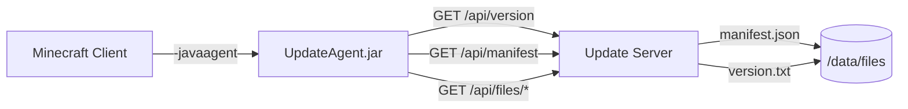

# Minecraft Auto Update Service

> Automatically sync and update Minecraft client resources via a self-hosted HTTP API and a Java agent.

[中文文档](./README_CN.md)

## Overview

This project provides a lightweight, self-hosted solution for keeping Minecraft client resources (mods, configs, resource packs, etc.) up to date across multiple machines. It consists of two parts:

| Component | Description |
|-----------|-------------|
| **Server** | A Flask-based HTTP API server that hosts file manifests, version info, and resource downloads. Runs in Docker. |
| **Agent** | A Java agent (`UpdateAgent.jar`) loaded at Minecraft client startup. It checks for updates, displays a GUI progress window, and syncs files before the game launches. |

## Architecture



## Features

- **Version-aware sync** — Only downloads files when the remote version changes.
- **Selective file management** — Control which files to sync via `managed_paths` in `update-config.json`.
- **GUI progress window** — Player sees update status before the game starts.
- **Dockerized server** — Single-container deployment with Alpine Linux.
- **Cross-platform agent** — Java agent works on Windows, Linux, and macOS.
- **RESTful API** — Clean HTTP endpoints for version, manifest, download, config, and health checks.
- **On-demand manifest generation** — Regenerate file manifests via HTTP API or CLI.

## Quick Start

### 1. Build and Run the Server

```bash
# Build the Docker image
docker build -t mc-update-service -f Dockerfile .

# Run the container
docker run -d \
  -p 25565:25565 \
  -v /path/to/your/files:/data/files \
  --name mc-update \
  mc-update-service
```

### 2. Generate a Manifest

Place your Minecraft resource files (mods, configs, etc.) under the mounted `files` directory, then generate the manifest:

```bash
# Via docker exec
docker exec mc-update python3 /app/generate_manifest.py "1.0.0"

# Or via HTTP API (if GENERATE_TOKEN is configured)
curl -X POST "http://localhost:25565/api/generate?version=1.0.0" \
  -H "X-Generate-Token: your-token"
```

### 3. Build and Install the Agent

```bash
cd agent

# Build the Java agent
./build.sh          # Linux/macOS
build.bat           # Windows

# Install agent into a Minecraft instance
./setup-agent.sh ~/.minecraft/versions/1.20.1 http://your-server:25565
```

The setup script adds the `-javaagent` argument to the Minecraft launcher's JVM options.

## API Reference

| Endpoint | Method | Description |
|----------|--------|-------------|
| `/api/version` | GET | Get the current remote version string |
| `/api/manifest` | GET | Get the full file manifest (paths, hashes, sizes) |
| `/api/files/<path>` | GET | Download a specific resource file |
| `/api/config` | GET | Get update configuration (`managed_paths`) |
| `/api/generate` | POST | Trigger manifest regeneration (token-protected) |
| `/api/health` | GET | Health check (manifest + version availability) |

## Configuration

### Server Environment Variables

| Variable | Default | Description |
|----------|---------|-------------|
| `PORT` | `25565` | HTTP server port |
| `HOST` | `0.0.0.0` | Bind address |
| `DATA_DIR` | `/data` | Data directory root |
| `GENERATE_TOKEN` | *(empty)* | Token for `/api/generate` protection |
| `DEBUG` | `false` | Enable Flask debug mode |

### Agent System Properties

Set via `-javaagent` arguments or JVM system properties:

| Property | Default | Description |
|----------|---------|-------------|
| `mc-update.server` | `http://localhost:25565` | Update server URL |
| `mc-update.game-dir` | `.` | Minecraft game directory |
| `mc-update.debug` | `false` | Show close button & keep window open |

Example:
```
-javaagent:UpdateAgent.jar=server=http://192.168.1.100:25565,game-dir=C:\minecraft,debug=true
```

### Managed Paths

Create an `update-config.json` in your data directory to control which files are synced:

```json
{
  "managed_paths": [
    "mods/",
    "config/",
    "resourcepacks/",
    "options.txt"
  ]
}
```

- Paths ending with `/` match directories recursively.
- Bare paths match exact files.
- Use `["*"]` to include all files (default).

## Project Structure

```
├── Dockerfile                  # Server Docker image
├── LICENSE                     # MIT License
├── server/
│   ├── app.py                  # Flask API server
│   ├── entrypoint.sh           # Container startup script
│   ├── generate_manifest.py    # Manifest generation tool
│   └── requirements.txt        # Python dependencies
├── agent/
│   ├── src/
│   │   └── UpdateAgent.java    # Java agent source
│   ├── META-INF/
│   │   └── MANIFEST.MF         # JAR manifest
│   ├── build.sh / build.bat    # Compilation scripts
│   └── setup-agent.sh / .bat   # Installation scripts
```

## License

MIT — See [LICENSE](./LICENSE) for details.
