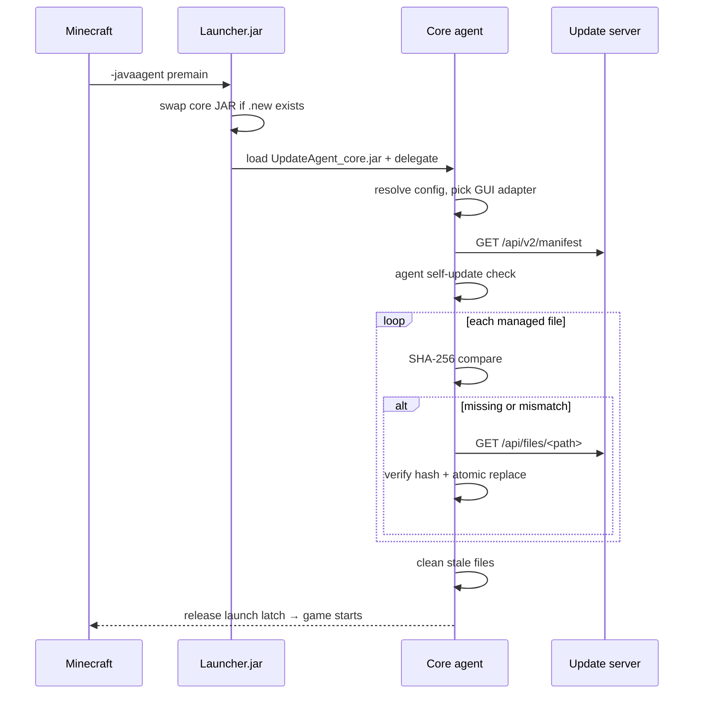

# Minecraft Auto Update Service

> Keep Minecraft client resources in sync across machines — via a self-hosted HTTP API and a Java agent.

- [中文文档](./README_CN.md)
- [GUI Adapter API](./GUI_ADAPTER_API.md) — build your own GUI toolkit.

## Overview

| Component | Role |
|-----------|------|
| **Server** (Python/Flask, Docker) | Hosts file manifests & resource downloads via a REST API. |
| **Agent** (Java, `-javaagent`) | Loaded at Minecraft startup — checks for updates, shows GUI progress, syncs files, then lets the game launch. |

### Two-JAR design (safe self-update)

| JAR | Role |
|-----|------|
| `UpdateAgent.jar` (Launcher) | Thin wrapper loaded by `-javaagent`. Replaces the core JAR at startup if a `.jar.new` exists, then delegates to it. **Never updated**, which avoids file-lock issues on Windows. |
| `UpdateAgent_core.jar` (Core) | The actual update logic: HTTP sync, GUI, file cleanup. **Can be self-updated** — a new version is downloaded as `.jar.new` and swapped in on the next launch. |

### Startup flow


```mermaid
sequenceDiagram
    participant MC as Minecraft
    participant L as Launcher.jar
    participant A as Core agent
    participant S as Update server
    MC->>L: -javaagent premain
    L->>L: swap core JAR if .new exists
    L->>A: load UpdateAgent_core.jar + delegate
    A->>A: resolve config, pick GUI adapter
    A->>S: GET /api/v2/manifest
    A->>A: agent self-update check
    loop each managed file
        A->>A: SHA-256 compare
        alt missing or mismatch
            A->>S: GET /api/files/<path>
            A->>A: verify hash + atomic replace
        end
    end
    A->>A: clean stale files
    A-->>MC: release launch latch → game starts
```

### Agent source layout

The core agent is composed of small layers (all under `com.zack88604.autoupdater`):

| Package | Responsibility |
|---------|----------------|
| `application` | `UpdateController` (lifecycle), `UpdateService` (business flow), events & state reducer. |
| `domain` | `Manifest`, `FileEntry`, `UpdateResult`, `AgentArtifact`. |
| `infrastructure` | `FileManager`, `ServerClient`, JSON parsing. |
| `gui.api` | Toolkit-neutral GUI contracts (what a custom GUI implements). |
| `gui.swing` | Built-in Swing adapter. |
| `gui.preset` | External GUI preset discovery & selection. |
| `bootstrap` / `config` | Agent entry point composition & configuration. |

## Quick Start

### Server

```bash
# Build from the parent directory
docker build -t mc-update-service -f Dockerfile .

# Run with file storage mounted
docker run -d -p 25565:25565 -v /path/to/files:/data/files -v /path/to/agent:/data/agent --name mc-update mc-update-service

# Place UpdateAgent_core.jar in the agent directory
cp UpdateAgent_core.jar /path/to/agent/

# Generate manifest after placing files under /data/files
docker exec mc-update python3 /app/generate_manifest.py --dir /data/files --out /data --agent-jar /data/agent/UpdateAgent_core.jar
```

### Agent

```bash
cd agent
./build.sh                              # or build.bat on Windows
./setup-agent.sh ~/.minecraft/versions/1.20.1 http://your-server:25565
```

The setup script writes server configuration to `mc-update.properties` in the game directory, and appends `-javaagent:<path>/UpdateAgent.jar` to the launcher's JVM arguments.

## API

| Endpoint | Method | Description |
|----------|--------|-------------|
| `/api/v2/manifest` | GET | Full file manifest (paths, SHA-256, sizes) |
| `/api/files/<path>` | GET | Download a resource file |
| `/api/agent` | GET | Download the latest `UpdateAgent_core.jar` |
| `/api/config` | GET | Managed paths & excluded paths configuration |
| `/api/generate` | POST | Regenerate manifest (token-protected) |
| `/api/health` | GET | Health check |

## GUI Adapter Development

The updater renders through a toolkit-neutral GUI boundary. The built-in Swing
adapter is the default; custom toolkits can plug in **without touching update
logic or lifecycle control** in two ways:

| Way | How | When to use |
|-----|-----|-------------|
| **Compile-in + property** | Compile your factory into the core JAR, set `mc-update.gui-adapter=<class>` | You own/rebuild the agent. |
| **External preset** | Drop a JAR into `.mc-update/gui-presets/`, choose it on first launch | Distributing a GUI independently, no agent rebuild. |

See [GUI Adapter API](GUI_ADAPTER_API.md) for the full tutorial and API reference.

## Configuration

### Server (env vars)

| Variable | Default | Description |
|----------|---------|-------------|
| `PORT` | `25565` | HTTP port |
| `GENERATE_TOKEN` | *(empty)* | Protects `/api/generate` |
| `DEBUG` | `false` | Flask debug mode |

### Agent (JVM properties)

Configuration is resolved in this order (normal mode):

1. `mc-update.properties` in the game directory *(written by setup script)*
2. Inline `-javaagent` arguments
3. `-D` system properties
4. Built-in defaults

(`admin=true` in the inline arguments reverses to: arguments → system properties → file.)

| Property | Default | Description |
|----------|---------|-------------|
| `mc-update.server` | `http://localhost:25565` | Server URL(s) — comma-separated for **multi-source fallback** |
| `mc-update.game-dir` | `.` | Minecraft directory |
| `mc-update.debug` | `false` | Keep GUI open after sync |
| `mc-update.gui-adapter` | *(built-in Swing)* | Fully qualified `GuiAdapterFactory` class |

**Recommended: `mc-update.properties`** (written by setup script):
```properties
server=http://cdn1.example.com:25565,http://cdn2.example.com:8443
```

**Inline agent args**:
```
-javaagent:UpdateAgent.jar=server=http://1.2.3.4:25565,game-dir=C:\mc,debug=true
```

**Multi-server fallback** (automatically tries the next server on failure):
```
-javaagent:UpdateAgent.jar=server=http://cdn1.example.com:25565,http://cdn2.example.com:8443
```

**Admin mode** (`admin=true`) — useful for one-off overrides; the inline value wins:
```
-javaagent:UpdateAgent.jar=admin=true,server=http://override:25565
```

### Selective Sync (`update-config.json`)

```json
{
  "managed_paths": ["mods/", "config/", "resourcepacks/", "options.txt"],
  "excluded_paths": ["config/secret.cfg", "mods/skip_this/"]
}
```

| Pattern | Matches |
|---------|---------|
| `path/` (trailing slash) | Everything under that directory, recursively |
| `file.txt` (bare name) | That exact file only |
| `*` | Everything (only valid as a whole `managed_paths` entry) |

`excluded_paths` override `managed_paths` — excluded files are neither synced nor
cleaned up. Defaults: `managed_paths: ["*"]`, `excluded_paths: []`.

## Project Structure

```
├── Dockerfile                    # Server image
├── GUI_ADAPTER_API.md            # Custom GUI guide (English / 中文)
├── server/
│   ├── app.py                    # Flask API
│   ├── entrypoint.sh             # Container entrypoint
│   ├── generate_manifest.py      # Manifest generator
│   └── requirements.txt
└── agent/
    ├── META-INF/MANIFEST.MF
    ├── build.sh / build.bat      # Builds both JARs
    ├── setup-agent.sh / setup-agent.bat
    └── src/
        ├── Launcher.java         # Launcher (never updated)
        ├── UpdateAgent.java      # Compatibility facade
        └── com/zack88604/autoupdater/
            ├── bootstrap/        # AgentBootstrap composition root
            ├── config/           # AgentConfig
            ├── application/      # Controller / Service / events / reducer
            ├── domain/           # Manifest / FileEntry / UpdateResult / AgentArtifact
            ├── infrastructure/   # files / http / json
            └── gui/              # api (contracts) / swing (default) / preset (external)
```

Build output:
- `UpdateAgent.jar` — Launcher JAR (loaded by `-javaagent`)
- `UpdateAgent_core.jar` — Core agent JAR (loaded dynamically; self-updatable)

## License

MIT
