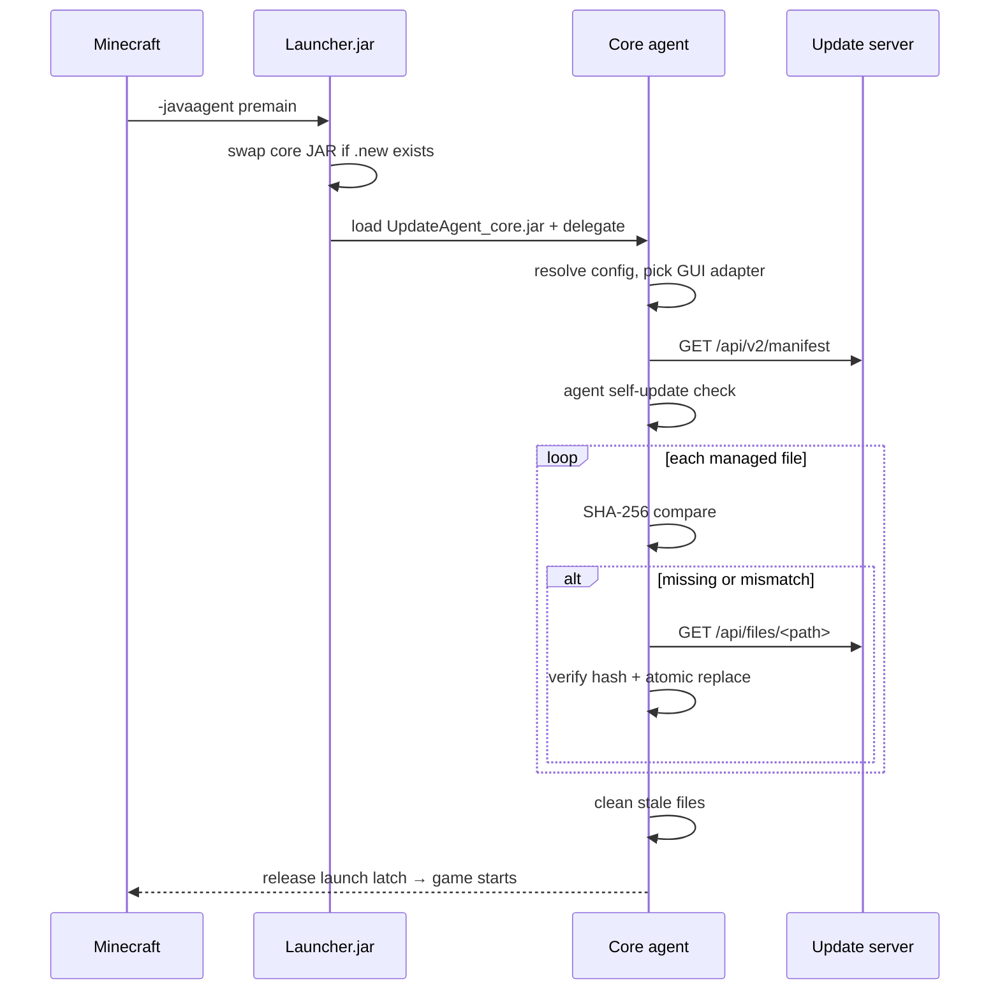

# Minecraft Auto Update Service

> Keep Minecraft client resources in sync across machines — via a self-hosted HTTP API and a Java agent.

- [中文说明](README_CN.md)
- [GUI Adapter API](GUI_ADAPTER_API.md) — build a custom GUI preset.
- [GUI Adapter API（中文）](GUI_ADAPTER_API_CN.md)

## Documentation map

| File | Audience | Purpose |
|------|----------|---------|
| `README.md` / `README_CN.md` | Operators and maintainers | Build, deploy, configure, and navigate the repository. |
| `GUI_ADAPTER_API.md` / `GUI_ADAPTER_API_CN.md` | GUI developers | Public GUI contract, V1 presets, and V2 isolated Java-helper presets. |

## Overview

| Component | Role |
|-----------|------|
| **Server** (Python/Flask, Docker) | Hosts file manifests & resource downloads via a REST API. |
| **Agent** (Java, `-javaagent`) | Loaded at Minecraft startup — checks for updates, shows GUI progress, syncs files, then lets the game launch. |

### Two-JAR design (safe self-update)

| JAR | Role |
|-----|------|
| `UpdateAgent.jar` (Launcher) | Thin wrapper loaded by `-javaagent`. Replaces the core JAR at startup if a `.jar.new` exists, then delegates to it. **Never updated**, which avoids file-lock issues on Windows. |
| `UpdateAgent_core.jar` (Core) | The actual update logic: HTTP sync, GUI, file cleanup. **Can be self-updated** — a new version is downloaded as `.jar.new` and swapped in on the next launch. |

### Startup flow


```mermaid
sequenceDiagram
    participant MC as Minecraft
    participant L as Launcher.jar
    participant A as Core agent
    participant S as Update server
    MC->>L: -javaagent premain
    L->>L: swap core JAR if .new exists
    L->>A: load UpdateAgent_core.jar + delegate
    A->>A: resolve config, pick GUI adapter
    A->>S: GET /api/v2/manifest
    A->>A: agent self-update check
    loop each managed file
        A->>A: SHA-256 compare
        alt missing or mismatch
            A->>S: GET /api/files/<path>
            A->>A: verify hash + atomic replace
        end
    end
    A->>A: clean stale files
    A-->>MC: release launch latch → game starts
```

### Agent source layout

The core agent is composed of small layers (all under `com.zack88604.autoupdater`):

| Package | Responsibility |
|---------|----------------|
| `application` | `UpdateController` (lifecycle), `UpdateService` (business flow), events, state reduction, and rate-limited state rendering. |
| `domain` | `Manifest`, `FileEntry`, `UpdateResult`, `AgentArtifact`. |
| `infrastructure` | `FileManager`, `ServerClient`, JSON parsing. |
| `gui.api` | Toolkit-neutral GUI contracts and Java-helper protocol APIs. |
| `gui.swing` | Built-in Swing adapter and trusted preset chooser. |
| `gui.preset` | V1 in-process and V2 isolated helper preset discovery, validation, and loading. |
| `bootstrap` / `config` | Agent entry point composition and configuration resolution. |

## Quick Start

### Server

```bash
# From this repository root: build the agent first
bash agent/build.sh

# Create persistent server data and publish the current core JAR
mkdir -p /srv/mc-update/files /srv/mc-update/agent /srv/mc-update/gui-presets
cp agent/UpdateAgent_core.jar /srv/mc-update/agent/

# Build and run the server from this repository root
docker build -t mc-update-service .
docker run -d -p 25565:25565 \
  -v /srv/mc-update:/data \
  --name mc-update mc-update-service

# After changing files or update-config.json, regenerate the manifest
docker exec mc-update python3 /app/generate_manifest.py \
  --dir /data/files --out /data --agent-jar /data/agent/UpdateAgent_core.jar
```

### Agent

```bash
# Linux/macOS (requires a JDK with javac)
bash agent/build.sh
bash agent/setup-agent.sh ~/.minecraft/versions/1.20.1 http://your-server:25565

# Windows
agent\build.bat
agent\setup-agent.bat C:\path\to\instance http://your-server:25565
```

The setup script writes server configuration to `mc-update.properties` in the game directory and appends `-javaagent:<path>/UpdateAgent.jar` to the launcher's JVM arguments.

Runtime files owned by the updater:

```text
<game-dir>/
├── mc-update.properties                 # persistent server/debug/adapter settings
└── .mc-update/
    ├── gui-selection.properties          # optional remembered GUI choice
    ├── gui-server-trust.properties       # approved signed server preset identity
    ├── gui-presets/                      # local and server-downloaded preset JARs
    └── gui-runtimes/                     # verified V2 helper runtime extraction
```

## API

| Endpoint | Method | Description |
|----------|--------|-------------|
| `/api/v2/manifest` | GET | Full file manifest (paths, SHA-256, sizes) |
| `/api/files/<path>` | GET | Download a resource file |
| `/api/agent` | GET | Download the latest `UpdateAgent_core.jar` |
| `/api/v2/gui-preset` | GET | Optional signed server GUI-preset descriptor |
| `/api/v2/gui-presets/<archive>.jar` | GET | Archive named by a signed GUI-preset descriptor |
| `/api/config` | GET | Managed paths & excluded paths configuration |
| `/api/generate` | POST | Regenerate manifest (token-protected) |
| `/api/health` | GET | Health check |

## GUI Adapter Development

The updater renders through a toolkit-neutral GUI boundary. The built-in Swing
adapter is the default; custom toolkits can plug in **without touching update
logic or lifecycle control** in two ways:

| Way | How | When to use |
|-----|-----|-------------|
| **Compile-in + property** | Compile your factory into the core JAR, set `mc-update.gui-adapter=<class>` | You own/rebuild the agent. |
| **External preset** | Drop a V1 adapter JAR or V2 Java-helper JAR into `.mc-update/gui-presets/`, then choose it on first launch | Distributing a GUI independently, no agent rebuild. |

See [GUI Adapter API](GUI_ADAPTER_API.md) for the full tutorial and API reference.

## Configuration

### Server (env vars)

| Variable | Default | Description |
|----------|---------|-------------|
| `PORT` | `25565` | HTTP port |
| `GENERATE_TOKEN` | *(empty)* | Protects `/api/generate` |
| `DEBUG` | `false` | Flask debug mode |

### Agent (JVM properties)

Configuration is resolved in this order (normal mode):

1. `mc-update.properties` in the game directory *(written by setup script)*
2. Inline `-javaagent` arguments
3. `-D` system properties
4. Built-in defaults

(`admin=true` in the inline arguments reverses to: arguments → system properties → file.)

| Property | Default | Description |
|----------|---------|-------------|
| `mc-update.server` | `http://localhost:25565` | Server URL(s) — comma-separated for **multi-source fallback** |
| `mc-update.game-dir` | `.` | Minecraft directory |
| `mc-update.debug` | `false` | Keep GUI open after sync |
| `mc-update.gui-adapter` | *(built-in Swing)* | Fully qualified `GuiAdapterFactory` class |
| `mc-update.server-gui` | `disabled` | `disabled`, `recommended`, or `required` server-preset policy |
| `mc-update.server-gui-key-id` | *(empty)* | Required signing key id for a server GUI preset |
| `mc-update.server-gui-public-key` | *(empty)* | Base64 X.509 Ed25519 public key pinned by this client |

**Recommended: `mc-update.properties`** (written by setup script):
```properties
server=http://cdn1.example.com:25565,http://cdn2.example.com:8443
```

**Inline agent args**:
```
-javaagent:UpdateAgent.jar=server=http://1.2.3.4:25565,game-dir=C:\mc,debug=true
```

**Multi-server fallback** (automatically tries the next server on failure):
```
-javaagent:UpdateAgent.jar=server=http://cdn1.example.com:25565,http://cdn2.example.com:8443
```

**Admin mode** (`admin=true`) — useful for one-off overrides; the inline value wins:
```
-javaagent:UpdateAgent.jar=admin=true,server=http://override:25565
```

### Server-published GUI presets

A server can publish one signed GUI preset outside the normal game-file manifest.
The client verifies the descriptor signature and JAR SHA-256 before it can
consider the archive. Remote GUI loading is disabled by default.

Place the JAR in /srv/mc-update/gui-presets/. Generate an Ed25519 key once,
keep its private half outside the server container, and create
/srv/mc-update/gui-preset.json after every JAR, version, file-name, or key-id
change:

    openssl genpkey -algorithm Ed25519 -out /secure/gui-preset-key.pem
    python3 -m pip install -r server/requirements.txt
    python3 server/sign_gui_preset.py \
      --preset /srv/mc-update/gui-presets/example-javafx.jar \
      --id example-javafx --version 1.0.0 --key-id official-2026 \
      --private-key /secure/gui-preset-key.pem \
      --out /srv/mc-update/gui-preset.json \
      --public-key-out /secure/gui-preset-public-key.b64

Copy the resulting Base64 public key into each client configuration:

    server-gui=recommended
    server-gui-key-id=official-2026
    server-gui-public-key=<Base64 X.509 Ed25519 public key>

recommended uses the verified server preset only when no remembered local choice
wins, while refreshing a selected server preset. required overrides a remembered
local choice only after the same preset identity has been approved. disabled is
the default. An explicit gui-adapter class always takes precedence.

On first use of an id + key-id + public-key fingerprint, the built-in Swing
dialog explains the external-code risk and asks for approval. Later signed
versions of that same identity load without another prompt. A changed signing
key or id requires a new approval. Java 15 or newer is required for Ed25519
verification; older JVMs fall back to Swing. Use HTTPS in production.

### Selective Sync (`update-config.json`)

Place this file in the mounted server data root (for the example above,
`/srv/mc-update/update-config.json`).

```json
{
  "managed_paths": ["mods/", "config/", "resourcepacks/", "options.txt"],
  "excluded_paths": ["config/secret.cfg", "mods/skip_this/"]
}
```

| Pattern | Matches |
|---------|---------|
| `path/` (trailing slash) | Everything under that directory, recursively |
| `file.txt` (bare name) | That exact file only |
| `*` | Everything (only valid as a whole `managed_paths` entry) |

`excluded_paths` override `managed_paths` — excluded files are neither synced nor
cleaned up. Defaults: `managed_paths: ["*"]`, `excluded_paths: []`.

## Project Structure

```text
├── README.md / README_CN.md              # operator and maintainer guides
├── GUI_ADAPTER_API.md / GUI_ADAPTER_API_CN.md  # public GUI extension contract
├── LICENSE                               # MIT license
├── Dockerfile                            # server image, built from this root
├── server/
│   ├── app.py                            # Flask API
│   ├── entrypoint.sh                     # container entrypoint
│   ├── generate_manifest.py              # manifest generator
│   ├── sign_gui_preset.py                 # signs a server GUI-preset descriptor
│   └── requirements.txt
└── agent/
    ├── META-INF/MANIFEST.MF              # java-agent launcher manifest
    ├── build.sh / build.bat              # builds the two JARs
    ├── setup-agent.sh / setup-agent.bat  # writes game-directory setup
    └── src/
        ├── Launcher.java                 # stable launcher, never self-updated
        ├── UpdateAgent.java              # compatibility facade
        └── com/zack88604/autoupdater/
            ├── bootstrap/                # composition root
            ├── config/                   # configuration precedence
            ├── application/              # update flow, cancellation, UI state pump
            ├── domain/                   # manifest value objects
            ├── infrastructure/           # files, HTTP, JSON
            └── gui/
                ├── api/                  # public GUI and helper contracts
                ├── swing/                # built-in fallback GUI
                └── preset/               # V1/V2 external preset runtime
```

Build output:
- `agent/UpdateAgent.jar` — launcher JAR loaded by `-javaagent`
- `agent/UpdateAgent_core.jar` — self-updatable core JAR

## License

MIT
