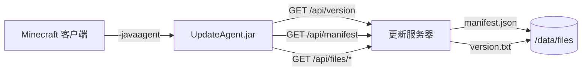

# Minecraft 自动更新服务

> 通过自托管 HTTP API 与 Java Agent，自动同步并更新 Minecraft 客户端资源。

[English](./README.md)

## 概述

本项目提供了一套轻量级、自托管的方案，用于在多台机器之间保持 Minecraft 客户端资源（模组、配置、资源包等）的同步更新。它由两部分组成：

| 组件 | 描述 |
|------|------|
| **服务端** | 基于 Flask 的 HTTP API 服务器，提供文件清单、版本信息、资源下载等服务，通过 Docker 运行。 |
| **客户端 Agent** | 一个 Java Agent（`UpdateAgent.jar`），在 Minecraft 客户端启动时加载，检查更新、显示 GUI 进度窗口，并在游戏启动前完成文件同步。 |

## 架构



## 特性

- **基于版本的增量同步** — 仅当远程版本变化时才下载文件。
- **选择性文件管理** — 通过 `update-config.json` 中的 `managed_paths` 精确控制同步范围。
- **GUI 进度窗口** — 玩家在游戏启动前即可看到更新状态。
- **Docker 化部署** — 基于 Alpine Linux 的单容器部署。
- **跨平台 Agent** — Java Agent 兼容 Windows、Linux、macOS。
- **RESTful API** — 清晰的 HTTP 接口：版本查询、清单获取、文件下载、配置查询、健康检查。
- **按需生成清单** — 支持通过 HTTP API 或命令行重新生成文件清单。

## 快速开始

### 1. 构建并运行服务端

```bash
# 构建 Docker 镜像
docker build -t mc-update-service -f Dockerfile .

# 运行容器
docker run -d \
  -p 25565:25565 \
  -v /path/to/your/files:/data/files \
  --name mc-update \
  mc-update-service
```

### 2. 生成资源清单

将 Minecraft 资源文件（模组、配置等）放入挂载的 `files` 目录，然后生成清单：

```bash
# 通过 docker exec
docker exec mc-update python3 /app/generate_manifest.py "1.0.0"

# 或通过 HTTP API（需配置 GENERATE_TOKEN）
curl -X POST "http://localhost:25565/api/generate?version=1.0.0" \
  -H "X-Generate-Token: your-token"
```

### 3. 构建并安装 Agent

```bash
cd agent

# 编译 Java Agent
./build.sh          # Linux/macOS
build.bat           # Windows

# 安装 Agent 到 Minecraft 实例
./setup-agent.sh ~/.minecraft/versions/1.20.1 http://your-server:25565
```

安装脚本会自动将 `-javaagent` 参数添加到 Minecraft 启动器的 JVM 选项中。

## API 参考

| 端点 | 方法 | 描述 |
|------|------|------|
| `/api/version` | GET | 获取当前远程版本号 |
| `/api/manifest` | GET | 获取完整文件清单（路径、哈希值、大小） |
| `/api/files/<path>` | GET | 下载指定资源文件 |
| `/api/config` | GET | 获取更新配置（`managed_paths`） |
| `/api/generate` | POST | 触发清单重新生成（Token 保护） |
| `/api/health` | GET | 健康检查（清单 + 版本是否可用） |

## 配置说明

### 服务端环境变量

| 变量 | 默认值 | 描述 |
|------|--------|------|
| `PORT` | `25565` | HTTP 服务端口 |
| `HOST` | `0.0.0.0` | 绑定地址 |
| `DATA_DIR` | `/data` | 数据目录根路径 |
| `GENERATE_TOKEN` | *(空)* | `/api/generate` 接口的访问令牌 |
| `DEBUG` | `false` | 是否启用 Flask 调试模式 |

### Agent 系统属性

通过 `-javaagent` 参数或 JVM 系统属性设置：

| 属性 | 默认值 | 描述 |
|------|--------|------|
| `mc-update.server` | `http://localhost:25565` | 更新服务器地址 |
| `mc-update.game-dir` | `.` | Minecraft 游戏目录 |
| `mc-update.debug` | `false` | 是否显示关闭按钮并保持窗口打开 |

示例：
```
-javaagent:UpdateAgent.jar=server=http://192.168.1.100:25565,game-dir=C:\minecraft,debug=true
```

### 管理路径配置

在数据目录中创建 `update-config.json` 来控制需要同步的文件范围：

```json
{
  "managed_paths": [
    "mods/",
    "config/",
    "resourcepacks/",
    "options.txt"
  ]
}
```

- 以 `/` 结尾的路径表示递归匹配该目录下所有文件。
- 不以 `/` 结尾的路径表示精确匹配该文件。
- 使用 `["*"]` 表示包含所有文件（默认行为）。

## 项目结构

```
├── Dockerfile                  # 服务端 Docker 镜像
├── LICENSE                     # MIT 许可证
├── server/
│   ├── app.py                  # Flask API 服务端
│   ├── entrypoint.sh           # 容器启动脚本
│   ├── generate_manifest.py    # 资源清单生成工具
│   └── requirements.txt        # Python 依赖
├── agent/
│   ├── src/
│   │   └── UpdateAgent.java    # Java Agent 源码
│   ├── META-INF/
│   │   └── MANIFEST.MF         # JAR 清单文件
│   ├── build.sh / build.bat    # 编译脚本
│   └── setup-agent.sh / .bat   # 安装脚本
```

## 许可证

MIT — 详见 [LICENSE](./LICENSE)。
