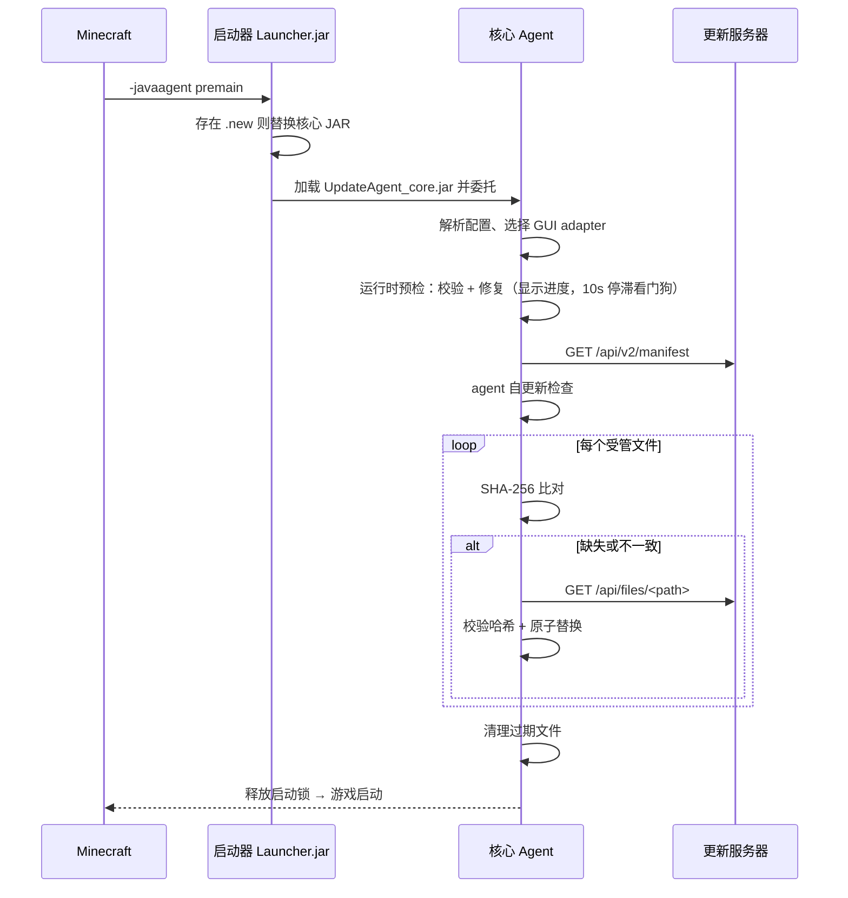

# Minecraft 自动更新服务

> 通过自托管 HTTP API 与 Java Agent，在多台机器间保持 Minecraft 客户端资源同步更新。

- [English](README.md)
- [GUI Adapter API](GUI_ADAPTER_API.md)
- [GUI Adapter API 中文说明](GUI_ADAPTER_API_CN.md) — 开发自定义 GUI 预设。

## 文档索引

| 文件 | 面向对象 | 作用 |
|------|----------|------|
| `README.md` / `README_CN.md` | 运维人员与维护者 | 构建、部署、配置与仓库导航。 |
| `GUI_ADAPTER_API.md` / `GUI_ADAPTER_API_CN.md` | GUI 开发者 | 对外 GUI 契约、V1 预设与 V2 隔离 Java helper 预设。 |

## 简介

| 组件 | 职责 |
|------|------|
| **服务端** (Python/Flask, Docker) | 托管文件清单与资源下载的 REST API。 |
| **Agent** (Java, `-javaagent`) | Minecraft 启动时加载 — 检查更新、准备内建 JavaFX GUI（隔离 helper JVM，Swing 自动回退）、同步文件，完成后启动游戏。 |

### 双 JAR 设计（安全自更新）

| JAR | 职责 |
|-----|------|
| `UpdateAgent.jar`（启动器） | 由 `-javaagent` 加载的薄封装层。启动时若存在 `.jar.new` 则替换核心 JAR，然后委托给核心逻辑。**永不更新**，避免了 Windows 平台的文件锁问题。 |
| `UpdateAgent_core.jar`（核心） | 实际的更新逻辑：HTTP 同步、GUI、文件清理。**可自更新** — 新版本下载为 `.jar.new`，下次启动时替换。 |

### 内建 JavaFX GUI（自动供应）

内建 GUI 是 JavaFX 21，但 Minecraft JVM **永远不会加载 `javafx.*`**。窗口运行在
**独立的 helper JVM** 中，通过 `--module-path <agent-dir>/javafx-runtime/<version>`
启动，并以 stdin/stdout 上的小型 JSONL 协议驱动；核心 agent 只投递非阻塞消息并
读回用户操作。

JavaFX 运行时是**自动供应的**。核心 JAR 内嵌 `javafx-runtime-spec.json`，固定了
当前平台的精确版本、模块 JAR、大小与 SHA-256 哈希。每次启动 agent 会：

1. 依据该 spec 校验本地 `javafx-runtime/<version>/` 目录。
2. 若缺失或损坏，且平台/JDK 支持（JDK 17+），**预检（preflight）**会在
   Minecraft 更新之前从 Maven Central（`org.openjfx`，默认
   `https://repo1.maven.org/maven2`）下载 JAR 并原子安装 — 在当前会话停留在
   Swing 的同时，在 GUI 中显示真实进度。
3. 预检**先于** Minecraft 更新运行，由 **10 秒停滞看门狗**约束，而不是总下载
   预算：只要有真实进展（字节、构件完成、校验、安装）持续到达，即使超过 30 秒
   或 60 秒也会继续等待；只有连续 10 秒毫无进展才算停滞 — 此时取消下载并在
   Swing 上继续，因此下载慢或失败都不会阻塞 Minecraft 启动。修复完成后，
   运行时将在**下次**启动时可用。

Swing 始终是自动回退：运行时缺失、JDK 过旧、平台不支持，或 helper JVM 无法启动、
崩溃、卡死时，更新器会用最新快照在 Swing 上重建同一个窗口。

### 启动流程


```mermaid
sequenceDiagram
    participant MC as Minecraft
    participant L as 启动器 Launcher.jar
    participant A as 核心 Agent
    participant S as 更新服务器
    MC->>L: -javaagent premain
    L->>L: 存在 .new 则替换核心 JAR
    L->>A: 加载 UpdateAgent_core.jar 并委托
    A->>A: 解析配置、选择 GUI adapter
    A->>A: 运行时预检：校验 + 修复（显示进度，10s 停滞看门狗）
    A->>S: GET /api/v2/manifest
    A->>A: agent 自更新检查
    loop 每个受管文件
        A->>A: SHA-256 比对
        alt 缺失或不一致
            A->>S: GET /api/files/<path>
            A->>A: 校验哈希 + 原子替换
        end
    end
    A->>A: 清理过期文件
    A-->>MC: 释放启动锁 → 游戏启动
```

### Agent 源码分层

核心 Agent 以小型分层组织（全部位于 `com.zack88604.autoupdater`）：

| 包 | 职责 |
|----|------|
| `application` | `UpdateController`（生命周期）、`UpdateService`（业务流程）、事件、状态归约、限频状态渲染，以及 `UpdatePreflight`（更新前的可选工作）。 |
| `domain` | `Manifest`、`FileEntry`、`UpdateResult`、`AgentArtifact`。 |
| `infrastructure` | `FileManager`、`ServerClient`、JSON 解析。 |
| `gui.api` | 与工具包无关的 GUI 契约与 Java helper 协议 API。 |
| `gui.swing` | 内建 Swing adapter 与受信任的预设选择器。 |
| `gui.preset` | V1 进程内与 V2 隔离 helper 预设的发现、校验与加载。 |
| `gui.javafx` | 内建 JavaFX GUI：隔离 helper JVM、运行时校验与修复、`GuiRuntimePreflight`、JSONL 传输。 |
| `bootstrap` / `config` | Agent 入口组装与配置优先级解析。 |

## 快速开始

### 服务端

```bash
# 在仓库根目录先构建 agent
bash agent/build.sh

# 创建持久化服务端数据，并放入当前 core JAR
mkdir -p /srv/mc-update/files /srv/mc-update/agent /srv/mc-update/gui-presets
cp agent/UpdateAgent_core.jar /srv/mc-update/agent/

# 在仓库根目录构建并启动服务端
docker build -t mc-update-service .
docker run -d -p 25565:25565 \
  -v /srv/mc-update:/data \
  --name mc-update mc-update-service

# 修改文件或 update-config.json 后重新生成清单
docker exec mc-update python3 /app/generate_manifest.py \
  --dir /data/files --out /data --agent-jar /data/agent/UpdateAgent_core.jar
```

### Agent

```bash
# Linux/macOS（需要带 javac 的 JDK）
bash agent/build.sh
bash agent/setup-agent.sh ~/.minecraft/versions/1.20.1 http://your-server:25565

# Windows
agent\build.bat
agent\setup-agent.bat C:\path\to\instance http://your-server:25565
```

`build.sh` / `build.bat` 首次构建时自动从 Maven Central 下载 JavaFX 21.0.4
build jars 到 `agent/lib/javafx/`（需要 curl 与网络），并把固定版本的
`javafx-runtime-spec.json` 嵌入核心 JAR — agent 用该 spec 在最终用户机器上下载并
校验 JavaFX 运行时。

安装脚本会将服务器配置写入游戏目录下的 `mc-update.properties`，并向启动器 JVM 参数追加 `-javaagent:<path>/UpdateAgent.jar`。

更新器拥有的运行时文件：

```text
<game-dir>/
├── mc-update.properties                 # 持久化 server/debug/adapter 设置
└── .mc-update/
    ├── gui-selection.properties          # 可选的已记住 GUI 选择
    ├── gui-server-trust.properties       # 已批准的服务端预设身份
    ├── gui-presets/                      # 本地及服务端下载的预设 JAR
    └── gui-runtimes/                     # 已校验的 V2 helper 运行时解压目录
```

JavaFX 运行时位于 **agent 核心 JAR 旁**（同一安装目录启动的所有实例共享），
不在游戏目录内：

```text
<agent-dir>/
└── javafx-runtime/
    ├── runtime.json                      # 已安装版本 + 平台 classifier
    ├── .installed                        # 完整安装的事务提交标记
    └── 21.0.4/                           # 依据内建 spec 校验的模块 JAR
```

## API

| 端点 | 方法 | 描述 |
|------|------|------|
| `/api/v2/manifest` | GET | 完整文件清单（路径、SHA-256、大小） |
| `/api/files/<path>` | GET | 下载指定资源文件 |
| `/api/agent` | GET | 下载最新 `UpdateAgent_core.jar` |
| `/api/v2/gui-preset` | GET | 可选的已签名服务端 GUI 预设描述 |
| `/api/v2/gui-presets/<archive>.jar` | GET | 描述文件指定的预设 JAR |
| `/api/config` | GET | 管理路径与排除路径配置 |
| `/api/generate` | POST | 重新生成清单（Token 保护） |
| `/api/health` | GET | 健康检查 |

## GUI Adapter 开发

更新器通过一个与工具包无关的 GUI 边界渲染界面。内建 JavaFX adapter（隔离 helper
JVM，Swing 自动回退）是默认实现；自定义工具包**无需改动更新逻辑与生命周期控制**
即可接入，有两种方式：

| 方式 | 做法 | 适用场景 |
|------|------|----------|
| **编译进核心 + 属性** | 把工厂编译进核心 JAR，配置 `mc-update.gui-adapter=<类名>` | 你维护/重新构建 agent |
| **外部预设** | 把 V1 adapter JAR 或 V2 Java-helper JAR 放进 `.mc-update/gui-presets/`，首次启动时选择 | 独立分发 GUI，无需重构建 agent |

内建 adapter — JavaFX（默认）与 Swing（回退）— 本身就是编译进核心的 adapter
（`com.zack88604.autoupdater.gui.javafx.JavaFxGuiAdapterFactory` /
`com.zack88604.autoupdater.gui.swing.SwingGuiAdapterFactory`）。外部代码风险确认
对话框仅适用于**外部**预设；内建 JavaFX 运行时依据固定 spec 校验，不会弹窗确认。

完整教程与 API 参考见 [GUI Adapter API](GUI_ADAPTER_API_CN.md)。

## 配置

### 服务端（环境变量）

| 变量 | 默认值 | 描述 |
|------|--------|------|
| `PORT` | `25565` | HTTP 端口 |
| `GENERATE_TOKEN` | *(空)* | 保护 `/api/generate` 接口 |
| `DEBUG` | `false` | Flask 调试模式 |

### Agent（JVM 属性）

配置优先级（普通模式）如下：

1. 游戏目录下的 `mc-update.properties` *（由安装脚本写入）*
2. 内联 `-javaagent` 参数
3. `-D` 系统属性
4. 内置默认值

（内联参数加 `admin=true` 时反转：参数 → 系统属性 → 配置文件。）

| 属性 | 默认值 | 描述 |
|------|--------|------|
| `mc-update.server` | `http://localhost:25565` | 服务器地址 — 支持**逗号分隔多源**，自动故障转移 |
| `mc-update.game-dir` | `.` | Minecraft 目录 |
| `mc-update.debug` | `false` | 同步完成后保持窗口打开 |
| `mc-update.gui-adapter` | *（内建 JavaFX，Swing 回退）* | `GuiAdapterFactory` 的完整类名 |
| `mc-update.server-gui` | `disabled` | 服务端预设策略：`disabled`、`recommended` 或 `required` |
| `mc-update.server-gui-key-id` | *（空）* | 服务端 GUI 预设要求的签名 key id |
| `mc-update.server-gui-public-key` | *（空）* | 客户端固定的 Base64 X.509 Ed25519 公钥 |

内建 JavaFX GUI 需要 JDK 17+，首次使用时从 Maven Central 下载 JavaFX 21 运行时
（见上文「内建 JavaFX GUI」）。下载以预检形式运行，在 Minecraft 更新前显示真实
进度并受 10 秒停滞看门狗约束；旧 JDK、离线机器与不支持的平台会自动留在 Swing —
可设置
`mc-update.gui-adapter=com.zack88604.autoupdater.gui.swing.SwingGuiAdapterFactory`
强制使用。

**推荐方式：`mc-update.properties`**（由安装脚本写入）：
```properties
server=http://cdn1.example.com:25565,http://cdn2.example.com:8443
```

**内联 agent 参数**：
```
-javaagent:UpdateAgent.jar=server=http://1.2.3.4:25565,game-dir=C:\mc,debug=true
```

**多源故障转移**（某源不可用时自动切换）：
```
-javaagent:UpdateAgent.jar=server=http://cdn1.example.com:25565,http://cdn2.example.com:8443
```

**管理员模式**（`admin=true`）— 适用于一次性覆盖，内联值优先：
```
-javaagent:UpdateAgent.jar=admin=true,server=http://override:25565
```

### 服务端发布 GUI 预设

服务器可以在普通游戏文件清单之外发布一个已签名的 GUI 预设。客户端会先校验
描述文件签名和 JAR 的 SHA-256；该能力默认禁用。

将 JAR 放到 /srv/mc-update/gui-presets/。只生成一次 Ed25519 密钥，并把私钥保存在
容器和公开数据卷之外。每次 JAR、版本、文件名或 key id 变化后，重新生成
/srv/mc-update/gui-preset.json：

    openssl genpkey -algorithm Ed25519 -out /secure/gui-preset-key.pem
    python3 -m pip install -r server/requirements.txt
    python3 server/sign_gui_preset.py \
      --preset /srv/mc-update/gui-presets/example-javafx.jar \
      --id example-javafx --version 1.0.0 --key-id official-2026 \
      --private-key /secure/gui-preset-key.pem \
      --out /srv/mc-update/gui-preset.json \
      --public-key-out /secure/gui-preset-public-key.b64

将输出的 Base64 公钥写入每个客户端的 mc-update.properties：

    server-gui=recommended
    server-gui-key-id=official-2026
    server-gui-public-key=<Base64 X.509 Ed25519 public key>

recommended 只会在没有优先级更高的本地已记住选择时使用服务器预设，并会刷新
已选中的服务器预设。required 会覆盖本地已记住选择，但仍需要用户首次批准同一
预设身份。disabled 为默认值；显式配置的 gui-adapter 始终优先。

首次使用某个 id + key-id + 公钥指纹时，内建 Swing 会显示外部代码风险提示并要求
确认。之后同一身份的已签名新版本不会重复提示；更换 id 或签名密钥会要求重新确认。
Ed25519 校验需要 Java 15 或更新版本；旧 JVM 会回退到 Swing。生产环境应使用 HTTPS。

### 选择性同步 (`update-config.json`)

将此文件放在挂载的服务端数据根目录；以上示例对应
`/srv/mc-update/update-config.json`。

```json
{
  "managed_paths": ["mods/", "config/", "resourcepacks/", "options.txt"],
  "excluded_paths": ["config/secret.cfg", "mods/skip_this/"]
}
```

| 写法 | 匹配范围 |
|------|----------|
| `path/`（斜杠结尾） | 该目录下的全部内容（递归） |
| `file.txt`（普通名称） | 仅该精确文件 |
| `*` | 全部（仅可作为整条 `managed_paths` 项） |

`excluded_paths` 优先级高于 `managed_paths` — 被排除的文件既不同步也不清理。
默认值：`managed_paths: ["*"]`，`excluded_paths: []`。

## 项目结构

```text
├── README.md / README_CN.md              # 运维与维护说明
├── GUI_ADAPTER_API.md / GUI_ADAPTER_API_CN.md  # 对外 GUI 扩展契约
├── LICENSE                               # MIT 许可证
├── Dockerfile                            # 服务端镜像，从此根目录构建
├── server/
│   ├── app.py                            # Flask API
│   ├── entrypoint.sh                     # 容器入口
│   ├── generate_manifest.py              # 清单生成器
│   ├── sign_gui_preset.py                 # 服务端预设描述签名工具
│   └── requirements.txt
└── agent/
    ├── META-INF/MANIFEST.MF              # java-agent 启动器清单
    ├── build.sh / build.bat              # 构建两个 JAR
    ├── setup-agent.sh / setup-agent.bat  # 写入游戏目录配置
    ├── javafx/
    │   ├── ui.css                        # JavaFX 样式表，嵌入核心 JAR
    │   └── javafx-runtime-spec.json      # 固定的 JavaFX 运行时 spec（SHA-256），嵌入核心 JAR
    ├── images/                           # JavaFX UI 插图，嵌入核心 JAR
    ├── lib/javafx/                       # JavaFX 21 build jars（自动下载，不入库）
    └── src/
        ├── Launcher.java                 # 稳定启动器，不自更新
        ├── UpdateAgent.java              # 兼容性 facade
        └── com/zack88604/autoupdater/
            ├── bootstrap/                # 组合根
            ├── config/                   # 配置优先级
            ├── application/              # 更新流程、取消、UI 状态泵、预检
            ├── domain/                   # 清单值对象
            ├── infrastructure/           # 文件、HTTP、JSON
            └── gui/
                ├── api/                  # 对外 GUI 与 helper 契约
                ├── javafx/               # 内建 JavaFX GUI（helper JVM + 运行时管理 + 预检）
                ├── swing/                # 内建回退 GUI
                └── preset/               # V1/V2 外部预设运行时
```

构建产物：
- `agent/UpdateAgent.jar` — 由 `-javaagent` 加载的启动器 JAR
- `agent/UpdateAgent_core.jar` — 可自更新的核心 Agent JAR

## 许可证

MIT
