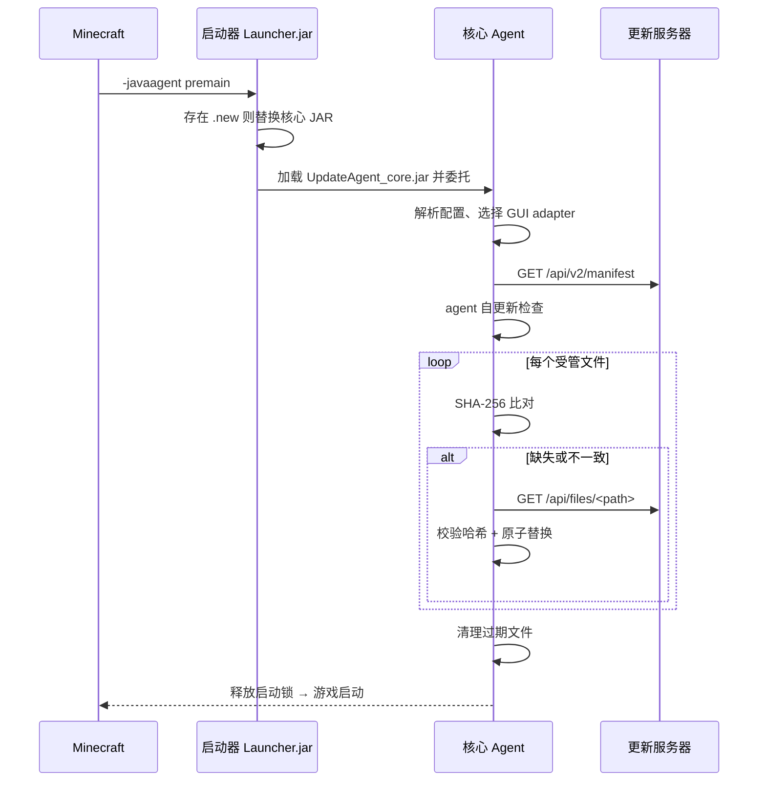

# Minecraft 自动更新服务

> 通过自托管 HTTP API 与 Java Agent，在多台机器间保持 Minecraft 客户端资源同步更新。

- [English](./README.md)
- [GUI Adapter API 中文说明](./GUI_ADAPTER_API_CN.md) — 打造你自己的 GUI 工具包。

## 简介

| 组件 | 职责 |
|------|------|
| **服务端** (Python/Flask, Docker) | 托管文件清单与资源下载的 REST API。 |
| **Agent** (Java, `-javaagent`) | Minecraft 启动时加载 — 检查更新、显示 GUI 进度、同步文件，完成后启动游戏。 |

### 双 JAR 设计（安全自更新）

| JAR | 职责 |
|-----|------|
| `UpdateAgent.jar`（启动器） | 由 `-javaagent` 加载的薄封装层。启动时若存在 `.jar.new` 则替换核心 JAR，然后委托给核心逻辑。**永不更新**，避免了 Windows 平台的文件锁问题。 |
| `UpdateAgent_core.jar`（核心） | 实际的更新逻辑：HTTP 同步、GUI、文件清理。**可自更新** — 新版本下载为 `.jar.new`，下次启动时替换。 |

### 启动流程


```mermaid
sequenceDiagram
    participant MC as Minecraft
    participant L as 启动器 Launcher.jar
    participant A as 核心 Agent
    participant S as 更新服务器
    MC->>L: -javaagent premain
    L->>L: 存在 .new 则替换核心 JAR
    L->>A: 加载 UpdateAgent_core.jar 并委托
    A->>A: 解析配置、选择 GUI adapter
    A->>S: GET /api/v2/manifest
    A->>A: agent 自更新检查
    loop 每个受管文件
        A->>A: SHA-256 比对
        alt 缺失或不一致
            A->>S: GET /api/files/<path>
            A->>A: 校验哈希 + 原子替换
        end
    end
    A->>A: 清理过期文件
    A-->>MC: 释放启动锁 → 游戏启动
```

### Agent 源码分层

核心 Agent 以小型分层组织（全部位于 `com.zack88604.autoupdater`）：

| 包 | 职责 |
|----|------|
| `application` | `UpdateController`（生命周期）、`UpdateService`（业务流程）、事件与状态归约。 |
| `domain` | `Manifest`、`FileEntry`、`UpdateResult`、`AgentArtifact`。 |
| `infrastructure` | `FileManager`、`ServerClient`、JSON 解析。 |
| `gui.api` | 与工具包无关的 GUI 契约（自定义 GUI 需要实现的内容）。 |
| `gui.swing` | 内建 Swing adapter。 |
| `gui.preset` | 外部 GUI 预设的发现与选择。 |
| `bootstrap` / `config` | Agent 入口组装与配置。 |

## 快速开始

### 服务端

```bash
# 从上级目录构建
docker build -t mc-update-service -f Dockerfile .

# 挂载文件存储目录运行
docker run -d -p 25565:25565 -v /path/to/files:/data/files -v /path/to/agent:/data/agent --name mc-update mc-update-service

# 将 UpdateAgent_core.jar 放入 agent 目录
cp UpdateAgent_core.jar /path/to/agent/

# 将资源文件放入 /data/files 后生成清单
docker exec mc-update python3 /app/generate_manifest.py --dir /data/files --out /data --agent-jar /data/agent/UpdateAgent_core.jar
```

### Agent

```bash
cd agent
./build.sh                              # Windows 用 build.bat
./setup-agent.sh ~/.minecraft/versions/1.20.1 http://your-server:25565
```

安装脚本会将服务器配置写入游戏目录下的 `mc-update.properties`，并向启动器 JVM 参数追加 `-javaagent:<path>/UpdateAgent.jar`。

## API

| 端点 | 方法 | 描述 |
|------|------|------|
| `/api/v2/manifest` | GET | 完整文件清单（路径、SHA-256、大小） |
| `/api/files/<path>` | GET | 下载指定资源文件 |
| `/api/agent` | GET | 下载最新 `UpdateAgent_core.jar` |
| `/api/config` | GET | 管理路径与排除路径配置 |
| `/api/generate` | POST | 重新生成清单（Token 保护） |
| `/api/health` | GET | 健康检查 |

## GUI Adapter 开发

更新器通过一个与工具包无关的 GUI 边界渲染界面。内建 Swing adapter 是默认实现；
自定义工具包**无需改动更新逻辑与生命周期控制**即可接入，有两种方式：

| 方式 | 做法 | 适用场景 |
|------|------|----------|
| **编译进核心 + 属性** | 把工厂编译进核心 JAR，配置 `mc-update.gui-adapter=<类名>` | 你维护/重新构建 agent |
| **外部预设** | 把一个 JAR 放进 `.mc-update/gui-presets/`，首次启动时选择 | 独立分发 GUI，无需重构建 agent |

完整教程与 API 参考见 [GUI Adapter API](GUI_ADAPTER_API_CN.md)。

## 配置

### 服务端（环境变量）

| 变量 | 默认值 | 描述 |
|------|--------|------|
| `PORT` | `25565` | HTTP 端口 |
| `GENERATE_TOKEN` | *(空)* | 保护 `/api/generate` 接口 |
| `DEBUG` | `false` | Flask 调试模式 |

### Agent（JVM 属性）

配置优先级（普通模式）如下：

1. 游戏目录下的 `mc-update.properties` *（由安装脚本写入）*
2. 内联 `-javaagent` 参数
3. `-D` 系统属性
4. 内置默认值

（内联参数加 `admin=true` 时反转：参数 → 系统属性 → 配置文件。）

| 属性 | 默认值 | 描述 |
|------|--------|------|
| `mc-update.server` | `http://localhost:25565` | 服务器地址 — 支持**逗号分隔多源**，自动故障转移 |
| `mc-update.game-dir` | `.` | Minecraft 目录 |
| `mc-update.debug` | `false` | 同步完成后保持窗口打开 |
| `mc-update.gui-adapter` | *（内建 Swing）* | `GuiAdapterFactory` 的完整类名 |

**推荐方式：`mc-update.properties`**（由安装脚本写入）：
```properties
server=http://cdn1.example.com:25565,http://cdn2.example.com:8443
```

**内联 agent 参数**：
```
-javaagent:UpdateAgent.jar=server=http://1.2.3.4:25565,game-dir=C:\mc,debug=true
```

**多源故障转移**（某源不可用时自动切换）：
```
-javaagent:UpdateAgent.jar=server=http://cdn1.example.com:25565,http://cdn2.example.com:8443
```

**管理员模式**（`admin=true`）— 适用于一次性覆盖，内联值优先：
```
-javaagent:UpdateAgent.jar=admin=true,server=http://override:25565
```

### 选择性同步 (`update-config.json`)

```json
{
  "managed_paths": ["mods/", "config/", "resourcepacks/", "options.txt"],
  "excluded_paths": ["config/secret.cfg", "mods/skip_this/"]
}
```

| 写法 | 匹配范围 |
|------|----------|
| `path/`（斜杠结尾） | 该目录下的全部内容（递归） |
| `file.txt`（普通名称） | 仅该精确文件 |
| `*` | 全部（仅可作为整条 `managed_paths` 项） |

`excluded_paths` 优先级高于 `managed_paths` — 被排除的文件既不同步也不清理。
默认值：`managed_paths: ["*"]`，`excluded_paths: []`。

## 项目结构

```
├── Dockerfile                    # 服务端镜像
├── GUI_ADAPTER_API.md            # 自定义 GUI 指南（中文在 GUI_ADAPTER_API_CN.md）
├── server/
│   ├── app.py                    # Flask API
│   ├── entrypoint.sh             # 容器入口
│   ├── generate_manifest.py      # 清单生成器
│   └── requirements.txt
└── agent/
    ├── META-INF/MANIFEST.MF
    ├── build.sh / build.bat      # 构建两个 JAR
    ├── setup-agent.sh / setup-agent.bat
    └── src/
        ├── Launcher.java         # 启动器（永不更新）
        ├── UpdateAgent.java      # 兼容性 facade
        └── com/zack88604/autoupdater/
            ├── bootstrap/        # AgentBootstrap 组合根
            ├── config/           # AgentConfig
            ├── application/      # Controller / Service / 事件 / 归约
            ├── domain/           # Manifest / FileEntry / UpdateResult / AgentArtifact
            ├── infrastructure/   # files / http / json
            └── gui/              # api（契约）/ swing（默认）/ preset（外部预设）
```

构建产物：
- `UpdateAgent.jar` — 启动器 JAR（由 `-javaagent` 加载）
- `UpdateAgent_core.jar` — 核心 Agent JAR（动态加载；可自更新）

## 许可证

MIT
